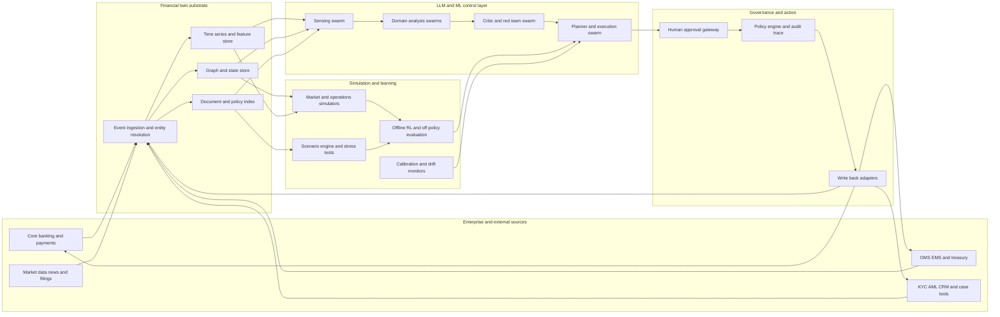

# FinTwinOS

**An auditable digital-twin operating system for financial organisations.**

FinTwinOS keeps a live, federated digital twin of a financial institution — books,
exposures, workflows, controls and customer journeys — and exposes it through **typed
LLM function-calls**, **specialised agent swarms**, **calibrated simulators** and
**bounded reinforcement learning**, all behind first-class governance gates. Before a
team or a model acts, the organisation can ask the twin what is likely to happen, what
could go wrong, which policies apply, and which human approvals are mandatory.

> Created and maintained by **[Yash Sharma](https://www.linkedin.com/in/yashsharmaa/)** · MIT License

This is not another chatbot or a generic agent framework. It is an operating system for
**simulating and steering financial decisions** across risk, trading, compliance,
treasury and customer operations — aggressive on simulation and evaluation,
deliberately conservative on autonomy.

## Why

- Financial firms have adopted AI broadly, but full autonomy remains rare and firms
  report only partial understanding of vendor models, rising third-party concentration
  and hidden model risk (BoE/FCA 2024 survey; FSB 2024).
- Finance-agent benchmarks (Finance Agent Benchmark, FinMCP-Bench, SECQUE, BlueFin,
  BFCL V4) show frontier models are still far from dependable on hard financial work.
- The open-source gap is not in agent wrappers — it is in **financially realistic,
  auditable, benchmarked** systems with inspectable orchestration, replaceable model
  routing and hybrid deployment.

## What's inside

| Layer | Modules | What it does |
|---|---|---|
| Twin substrate | `fintwinos/twin_core` | Entity resolution, graph + time-series + document stores, event ingestion, replay engine |
| Simulation | `fintwinos/twin_sim` | Agent-based market sim, treasury liquidity, compliance/fraud-ring, customer-ops queues — all with confidence intervals and calibration diagnostics |
| Tool layer | `fintwinos/tools` | Typed `observe_*` / `simulate_*` / `propose_*` / `execute_*` tools with risk tier, side-effect class, approval policy and provenance; MCP-style JSON-RPC server |
| Agent swarms | `fintwinos/agents` | Planner, sensing, risk, compliance, treasury, customer-ops, critic/red-team agents and a durable case orchestrator |
| Models | `fintwinos/models` | OpenAI LLM routing with cost metering and offline stubs; graph AML scoring; time-series forecasters; tabular scorecards |
| Learning | `fintwinos/rl` | Replay buffers, conservative offline RL, contextual bandits, off-policy evaluation, shadow-mode deployment gating |
| Governance | `fintwinos/policy` | Policy gates, YAML rule packs, maker-checker approvals, dual control, break-glass, kill switch — plus a tamper-evident, hash-chained audit trail |
| Evaluation | `fintwinos/evals` | Function-call exactness, agent-run consistency, domain metric suites, benchmark adapters, report generation |
| Data | `fintwinos/connectors`, `fintwinos/datasets` | EDGAR, CSV/CDC/webhook connectors; synthetic generators for transactions, fraud rings, journeys, market paths; data cards |
| Demos | `fintwinos/demos`, `examples/` | Liquidity stress, AML triage, analyst research, customer ops and an end-to-end day-in-the-life — all runnable fully offline |

## Quickstart

```bash
pip install -e ".[dev,server]"

# Run completely offline — no API key, no network:
FINTWIN_OFFLINE=1 fintwinos demo liquidity
FINTWIN_OFFLINE=1 fintwinos demo aml_triage
FINTWIN_OFFLINE=1 fintwinos eval all

# With OpenAI (the default LLM provider):
export OPENAI_API_KEY=sk-...
fintwinos demo day_in_the_life

# Serve the typed tool catalog over MCP-style JSON-RPC:
fintwinos serve-tools

# Inspect configuration and export canonical JSON Schemas:
fintwinos info
fintwinos export-schemas
```

## Safety posture

The execute tool band is **off by default** (`FINTWIN_EXECUTE_TOOLS_ENABLED=0`). Even
when enabled, every execute call needs (1) an explicit policy allow-rule, (2) a valid
human approval token, and (3) passes through the hash-chained audit trail. Observe,
simulate and propose tools are structurally side-effect free. The deployment rule:
**no write-enabled production access until a workflow passes replay, shadow mode, human
review and control testing.**

## Architecture



See [`docs/architecture.md`](docs/architecture.md) for the full reference architecture,
[`docs/governance-controls-map.md`](docs/governance-controls-map.md) for the
regulator-facing controls map (SR 11-7, DORA, EU AI Act, NIST AI RMF, NIST IR 8356),
and [`docs/evaluation.md`](docs/evaluation.md) for the evaluation stack and release gates.

## Development

```bash
pip install -e ".[dev,server]"
ruff check fintwinos tests
pytest
```

See [`CONTRACTS.md`](CONTRACTS.md) for module boundaries and entry-point contracts.

## License

MIT © 2026 [Yash Sharma](https://www.linkedin.com/in/yashsharmaa/). See [LICENSE](LICENSE).
