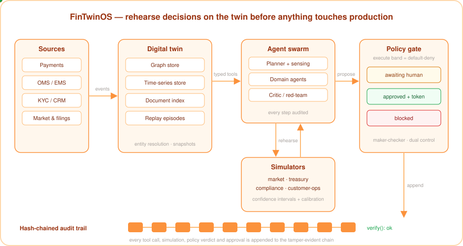
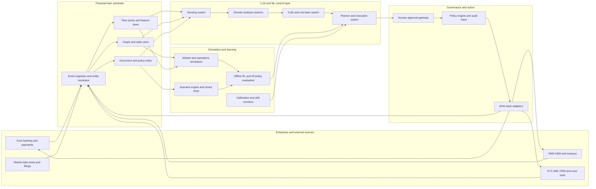

<div align="center">


# FinTwinOS

**An auditable digital-twin operating system for financial organisations.**

<p>
  <a href="https://github.com/YashSharmaa/FinTwinOS/actions/workflows/ci.yml"></a>
  
  
  
  
  
  
</p>

*Before a team or a model acts, ask the twin what is likely to happen, what could go wrong,*
*which policies apply, and which human approvals are mandatory.*

</div>

---

FinTwinOS keeps a live, federated digital twin of a financial institution, books,
exposures, workflows, controls and customer journeys, and exposes it through **typed
LLM function-calls**, **specialised agent swarms**, **calibrated simulators** and
**bounded reinforcement learning**, all behind first-class governance gates.

This is not another chatbot or a generic agent framework. It is an operating system for
**simulating and steering financial decisions** across risk, trading, compliance,
treasury and customer operations, aggressive on simulation and evaluation,
deliberately conservative on autonomy.

## How it works

<p align="center">
  
</p>

1. **Observe**, connectors stream events into the twin's graph, time-series and
   document stores; every record carries provenance.
2. **Simulate**, agent swarms rehearse the decision on calibrated simulators that
   return confidence intervals, never bare point estimates.
3. **Propose**, the planner aggregates domain analyses, a red-team critic attacks the
   draft, and the policy gate issues a verdict.
4. **Execute (gated)**, the execute band is default-deny: it needs an explicit policy
   allow-rule, a valid human approval token *and* a global enable flag, and every step
   lands on the tamper-evident audit chain.

## Why

- Financial firms have adopted AI broadly, but full autonomy remains rare and firms
  report only partial understanding of vendor models, rising third-party concentration
  and hidden model risk (BoE/FCA 2024 survey; FSB 2024).
- Finance-agent benchmarks (Finance Agent Benchmark, FinMCP-Bench, SECQUE, BlueFin,
  BFCL V4) show frontier models are still far from dependable on hard financial work.
- The open-source gap is not in agent wrappers, it is in **financially realistic,
  auditable, benchmarked** systems with inspectable orchestration, replaceable model
  routing and hybrid deployment.

## What's inside

| Layer | Modules | What it does |
|---|---|---|
| 🏦 Twin substrate | `fintwinos/twin_core` | Entity resolution, graph + time-series + document stores, event ingestion, replay engine |
| 🎛️ Simulation | `fintwinos/twin_sim` | Agent-based market sim, treasury liquidity, compliance/fraud-ring, customer-ops queues, all with confidence intervals and calibration diagnostics |
| 🔧 Tool layer | `fintwinos/tools` | Typed `observe_*` / `simulate_*` / `propose_*` / `execute_*` tools with risk tier, side-effect class, approval policy and provenance; MCP-style JSON-RPC server |
| 🤖 Agent swarms | `fintwinos/agents` | Planner, sensing, risk, compliance, treasury, customer-ops, critic/red-team agents and a durable case orchestrator |
| 🧠 Models | `fintwinos/models` | OpenAI LLM routing with cost metering and offline stubs; graph AML scoring; time-series forecasters; tabular scorecards |
| 📈 Learning | `fintwinos/rl` | Replay buffers, conservative offline RL, contextual bandits, off-policy evaluation, shadow-mode deployment gating |
| 🛡️ Governance | `fintwinos/policy` | Policy gates, YAML rule packs, maker-checker approvals, dual control, break-glass, kill switch, plus a tamper-evident, hash-chained audit trail |
| ✅ Evaluation | `fintwinos/evals` | Function-call exactness, agent-run consistency, domain metric suites, benchmark adapters, report generation |
| 🔌 Data | `fintwinos/connectors`, `fintwinos/datasets` | EDGAR, CSV/CDC/webhook connectors; synthetic generators for transactions, fraud rings, journeys, market paths; data cards |
| 🎬 Demos | `fintwinos/demos`, `examples/` | Liquidity stress, AML triage, analyst research, customer ops and an end-to-end day-in-the-life, all runnable fully offline |

## The five domains

All five domains run on the **same substrate**, a stateful twin, not just prompts.
Compliance is a subgraph problem; trading and treasury need calibrated time-series and
scenario engines; risk needs versioned models and counterfactual replay; customer
operations needs calibrated queue and persona simulation. That is why FinTwinOS is an
operating system rather than a wrapper.

| Domain | What the twin mirrors | What the swarm does | Value |
|---|---|---|---|
| **Risk** | Positions, exposures, limits, market regimes, model versions | Stress-tests shocks, ranks hedges, explains limit breaches, detects regime shifts | Faster stress testing, clearer limit governance, model lineage |
| **Trading** | Order flow, inventory, venue conditions, market-impact assumptions | Rehearses routing/execution/inventory choices before production | Lower slippage risk, safer strategy iteration, better surveillance |
| **Compliance** | Customer/entity graph, KYC docs, alerts, policy corpus, case history | Scores AML subgraphs, prioritises alerts, drafts narratives, tunes thresholds | Higher analyst throughput with preserved auditability |
| **Treasury** | Cash ladders, collateral, intraday liquidity, funding spreads | Simulates liquidity stress, recommends transfers, prioritises contingency actions | Better resilience and funding efficiency under stress |
| **Customer ops** | Journey state, channels, documents, complaints, SLA queues | Routes cases, predicts escalations, drafts compliant responses, simulates policy | Lower handling time, fewer SLA breaches |

## Who it's for, industries & use cases

| Industry | Representative use cases |
|---|---|
| **Global & retail banks** | Intraday liquidity stress rehearsal; AML alert triage with graph scoring; SR 11-7 model inventory & effective challenge; KYC-refresh case routing |
| **Asset managers · hedge funds · prop trading** | Pre-trade market-impact and routing rehearsal; portfolio shock testing with Expected-Shortfall rewards; surveillance and limit governance |
| **Payments & fintechs · neobanks** | Real-time fraud-ring detection on the transaction graph; complaint/SLA queue simulation; chargeback and dispute case automation behind approvals |
| **Insurers** | Exposure accumulation and catastrophe scenario rehearsal; claims-triage queues; conduct-risk review of automated decisions |
| **Market infrastructure** (exchanges, CCPs, custodians) | Default-management and margin-stress rehearsal; collateral optimisation; resilience/incident drills (DORA) |
| **RegTech · model-risk · compliance teams** | A regulator-ready control plane: tamper-evident audit, maker-checker, kill switch, break-glass, and a controls map to SR 11-7 / DORA / EU AI Act / NIST AI RMF |
| **Corporate treasury** | Multi-currency cash-ladder stress, funding-cost optimisation, contingency-action prioritisation |

The common thread: institutions can **rehearse decisions on a calibrated twin and prove
the control story** before anything touches a production system, exactly the
inspectable, hybrid-deployable, regulator-ready posture the 2024–2026 supervisory and
benchmark evidence calls for.

## Seeing it work

`fintwinos demo aml_triage` runs the whole stack on a seeded demo bank, offline with
deterministic stubs, or live against OpenAI with a key. The AML subgraph scorer ranks a
laundering ring, an LLM drafts the case narrative over real twin entities, and the
**governance plane** does its job:

```text
execute_close_case · attempt without approval
  refused, execute band is disabled (FINTWIN_EXECUTE_TOOLS_ENABLED=0)

execute_close_case · with granted ApprovalToken (dual control)
  executed, approval apr_… granted by mlro.on.duty + deputy.mlro

Audit trail (tail)
  approval.requested → approval.approved → approval.approved → approval.granted
  → policy.checked → tool.called → case.closed → tool.completed   (hash-chained)
```

Run live and the planner returns `status: awaiting_human`, `action_type: propose_only`,
the system proposes, it does not act. Conservative-on-autonomy by construction.

## Quickstart

```bash
pip install -e ".[dev,server]"

# Run completely offline, no API key, no network:
FINTWIN_OFFLINE=1 fintwinos demo liquidity
FINTWIN_OFFLINE=1 fintwinos demo aml_triage
FINTWIN_OFFLINE=1 fintwinos eval all

# With OpenAI (the default LLM provider):
export OPENAI_API_KEY=sk-...
fintwinos demo day_in_the_life

# Serve the typed tool catalog over MCP-style JSON-RPC:
fintwinos serve-tools

# Ingest data, browse datasets, run the bounded RL pipeline, prove replay determinism:
fintwinos ingest trades.csv --kind trade.executed --entity-type trade
fintwinos ingest --edgar 320193          # SEC EDGAR filings -> document store
fintwinos datasets list                  # registered datasets + offline availability
fintwinos rl --report-dir .fintwinos/rl  # log -> train -> OPE -> shadow -> gate
fintwinos replay-verify                  # rebuild the twin from its episode, compare hashes

# Operate the platform kill switch (optional --role enforces RBAC):
fintwinos killswitch engage --band execute --reason "incident-7" --role operator

# Inspect configuration and export canonical JSON Schemas:
fintwinos info
fintwinos export-schemas
```

## Safety posture

The execute tool band is **off by default** (`FINTWIN_EXECUTE_TOOLS_ENABLED=0`). Even
when enabled, every execute call needs (1) an explicit policy allow-rule, (2) a valid
human approval token, and (3) passes through the hash-chained audit trail. Observe,
simulate and propose tools are structurally side-effect free. The deployment rule:
**no write-enabled production access until a workflow passes replay, shadow mode, human
review and control testing.**

## Evaluation & release gates

`fintwinos eval all` runs the full evaluation stack offline and checks **8 release
gates**, function-call exactness, tool-hallucination rate, multi-run consistency, and
domain floors for risk, treasury, compliance and customer operations. Gates fail
conservatively: no evidence means no promotion. See
[`docs/evaluation.md`](docs/evaluation.md) for the gate definitions and the headline
experiments.

## Architecture



See [`docs/architecture.md`](docs/architecture.md) for the full reference architecture,
[`docs/governance-controls-map.md`](docs/governance-controls-map.md) for the
regulator-facing controls map (SR 11-7, DORA, EU AI Act, NIST AI RMF, NIST IR 8356),
and [`docs/evaluation.md`](docs/evaluation.md) for the evaluation stack and release gates.

## Development

```bash
pip install -e ".[dev,server]"
ruff check fintwinos tests
pytest
```

See [`CONTRACTS.md`](CONTRACTS.md) for module boundaries and entry-point contracts.

## License

MIT © 2026 Yash Sharma. See [LICENSE](LICENSE).

<div align="center">

---


**Created and maintained by Yash Sharma**

<a href="https://www.linkedin.com/in/yashsharmaa/"></a>

</div>
