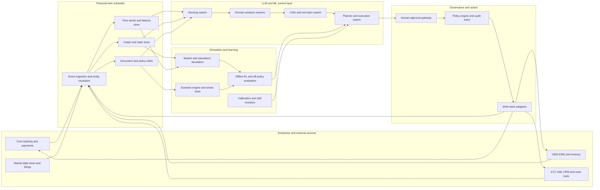

<div align="center">


# FinTwinOS

**An auditable digital-twin operating system for financial organisations.**

<p>
  <a href="https://github.com/YashSharmaa/FinTwinOS/actions/workflows/ci.yml"></a>
  
  
  
  
  
  
</p>

*Before a team or a model acts, ask the twin what is likely to happen, what could go wrong,*
*which policies apply, and which human approvals are mandatory.*

</div>

---

FinTwinOS keeps a live, federated digital twin of a financial institution, books,
exposures, workflows, controls and customer journeys, and exposes it through **typed
LLM function-calls**, **specialised agent swarms**, **calibrated simulators** and
**bounded reinforcement learning**, all behind first-class governance gates.

This is not another chatbot or a generic agent framework. It is an operating system for
**simulating and steering financial decisions** across risk, trading, compliance,
treasury and customer operations, aggressive on simulation and evaluation,
deliberately conservative on autonomy.

## How it works

<p align="center">
  
</p>

1. **Observe**, connectors stream events into the twin's graph, time-series and
   document stores; every record carries provenance.
2. **Simulate**, agent swarms rehearse the decision on calibrated simulators that
   return confidence intervals, never bare point estimates.
3. **Propose**, the planner aggregates domain analyses, a red-team critic attacks the
   draft, and the policy gate issues a verdict.
4. **Execute (gated)**, the execute band is default-deny: it needs an explicit policy
   allow-rule, a valid human approval token *and* a global enable flag, and every step
   lands on the tamper-evident audit chain.

## Why

- Financial firms have adopted AI broadly, but full autonomy remains rare and firms
  report only partial understanding of vendor models, rising third-party concentration
  and hidden model risk (BoE/FCA 2024 survey; FSB 2024).
- Finance-agent benchmarks (Finance Agent Benchmark, FinMCP-Bench, SECQUE, BlueFin,
  BFCL V4) show frontier models are still far from dependable on hard financial work.
- The open-source gap is not in agent wrappers, it is in **financially realistic,
  auditable, benchmarked** systems with inspectable orchestration, replaceable model
  routing and hybrid deployment.

## What's inside

| Layer | Modules | What it does |
|---|---|---|
| 🏦 Twin substrate | `fintwinos/twin_core` | Entity resolution, graph + time-series + document stores, event ingestion, replay engine |
| 🎛️ Simulation | `fintwinos/twin_sim` | Agent-based market sim, treasury liquidity, compliance/fraud-ring, customer-ops queues, all with confidence intervals and calibration diagnostics |
| 🔧 Tool layer | `fintwinos/tools` | Typed `observe_*` / `simulate_*` / `propose_*` / `execute_*` tools with risk tier, side-effect class, approval policy and provenance; MCP-style JSON-RPC server |
| 🤖 Agent swarms | `fintwinos/agents` | Planner, sensing, risk, compliance, treasury, customer-ops, critic/red-team agents and a durable case orchestrator |
| 🧠 Models | `fintwinos/models` | OpenAI LLM routing with cost metering and offline stubs; graph AML scoring; time-series forecasters; tabular scorecards |
| 📈 Learning | `fintwinos/rl` | Replay buffers, conservative offline RL, contextual bandits, off-policy evaluation, shadow-mode deployment gating |
| 🛡️ Governance | `fintwinos/policy` | Policy gates, YAML rule packs, maker-checker approvals, dual control, break-glass, kill switch, plus a tamper-evident, hash-chained audit trail |
| ✅ Evaluation | `fintwinos/evals` | Function-call exactness, agent-run consistency, domain metric suites, benchmark adapters, report generation |
| 🔌 Data | `fintwinos/connectors`, `fintwinos/datasets` | EDGAR, CSV/CDC/webhook connectors; synthetic generators for transactions, fraud rings, journeys, market paths; data cards |
| 🎬 Demos | `fintwinos/demos`, `examples/` | Liquidity stress, AML triage, analyst research, customer ops and an end-to-end day-in-the-life, all runnable fully offline |

## The five domains

All five domains run on the **same substrate**, a stateful twin, not just prompts.
Compliance is a subgraph problem; trading and treasury need calibrated time-series and
scenario engines; risk needs versioned models and counterfactual replay; customer
operations needs calibrated queue and persona simulation. That is why FinTwinOS is an
operating system rather than a wrapper.

| Domain | What the twin mirrors | What the swarm does | Value |
|---|---|---|---|
| **Risk** | Positions, exposures, limits, market regimes, model versions | Stress-tests shocks, ranks hedges, explains limit breaches, detects regime shifts | Faster stress testing, clearer limit governance, model lineage |
| **Trading** | Order flow, inventory, venue conditions, market-impact assumptions | Rehearses routing/execution/inventory choices before production | Lower slippage risk, safer strategy iteration, better surveillance |
| **Compliance** | Customer/entity graph, KYC docs, alerts, policy corpus, case history | Scores AML subgraphs, prioritises alerts, drafts narratives, tunes thresholds | Higher analyst throughput with preserved auditability |
| **Treasury** | Cash ladders, collateral, intraday liquidity, funding spreads | Simulates liquidity stress, recommends transfers, prioritises contingency actions | Better resilience and funding efficiency under stress |
| **Customer ops** | Journey state, channels, documents, complaints, SLA queues | Routes cases, predicts escalations, drafts compliant responses, simulates policy | Lower handling time, fewer SLA breaches |

## Who it's for, industries & use cases

| Industry | Representative use cases |
|---|---|
| **Global & retail banks** | Intraday liquidity stress rehearsal; AML alert triage with graph scoring; SR 11-7 model inventory & effective challenge; KYC-refresh case routing |
| **Asset managers · hedge funds · prop trading** | Pre-trade market-impact and routing rehearsal; portfolio shock testing with Expected-Shortfall rewards; surveillance and limit governance |
| **Payments & fintechs · neobanks** | Real-time fraud-ring detection on the transaction graph; complaint/SLA queue simulation; chargeback and dispute case automation behind approvals |
| **Insurers** | Exposure accumulation and catastrophe scenario rehearsal; claims-triage queues; conduct-risk review of automated decisions |
| **Market infrastructure** (exchanges, CCPs, custodians) | Default-management and margin-stress rehearsal; collateral optimisation; resilience/incident drills (DORA) |
| **RegTech · model-risk · compliance teams** | A regulator-ready control plane: tamper-evident audit, maker-checker, kill switch, break-glass, and a controls map to SR 11-7 / DORA / EU AI Act / NIST AI RMF |
| **Corporate treasury** | Multi-currency cash-ladder stress, funding-cost optimisation, contingency-action prioritisation |

The common thread: institutions can **rehearse decisions on a calibrated twin and prove
the control story** before anything touches a production system, exactly the
inspectable, hybrid-deployable, regulator-ready posture the 2024–2026 supervisory and
benchmark evidence calls for.

## Seeing it work

`fintwinos demo aml_triage` runs the whole stack on a seeded demo bank, offline with
deterministic stubs, or live against OpenAI with a key. The AML subgraph scorer ranks a
laundering ring, an LLM drafts the case narrative over real twin entities, and the
**governance plane** does its job:

```text
execute_close_case · attempt without approval
  refused, execute band is disabled (FINTWIN_EXECUTE_TOOLS_ENABLED=0)

execute_close_case · with granted ApprovalToken (dual control)
  executed, approval apr_… granted by mlro.on.duty + deputy.mlro

Audit trail (tail)
  approval.requested → approval.approved → approval.approved → approval.granted
  → policy.checked → tool.called → case.closed → tool.completed   (hash-chained)
```

Run live and the planner returns `status: awaiting_human`, `action_type: propose_only`,
the system proposes, it does not act. Conservative-on-autonomy by construction.

## A full day, end to end

`fintwinos demo day_in_the_life` runs one institution through four desks, Treasury,
Financial crime, Research and Customer operations, then closes the day with a governance
summary, every step on a single hash-chained audit trail. It runs two ways, same pipeline
and same controls:

```bash
# Deterministic, no key, no network (rule-based fallbacks):
FINTWIN_OFFLINE=1 fintwinos demo day_in_the_life

# Live on OpenAI, the same flow with real gpt-5 reasoning:
export OPENAI_API_KEY=sk-...
fintwinos demo day_in_the_life
```

The two runs are structurally identical; the only difference is the prose. Offline uses
deterministic rule-based templates, live uses gpt-5 (compare the AML case narrative and the
planner rationale in the two transcripts below). Both end the same way: propose-only, human
approval required, the execute band gated, and the audit chain intact.

**Close of day, governance summary (live gpt-5 run):**

```text
───────────────────────────── 18:05 · Close of day, governance ─────────────────────────────
Tool calls by band                                                           
┏━━━━━━━━━━┳━━━━━━━┳━━━━━━━━━━━━━━━━━━━━━━━━━━━━━━━━━━━━━━━━━━━━━━━━━━━━━━━━┓
┃ band     ┃ calls ┃ governance posture                                     ┃
┡━━━━━━━━━━╇━━━━━━━╇━━━━━━━━━━━━━━━━━━━━━━━━━━━━━━━━━━━━━━━━━━━━━━━━━━━━━━━━┩
│ observe  │    10 │ side-effect free, audited                              │
│ simulate │     3 │ side-effect free, calibrated, audited                  │
│ propose  │     1 │ side-effect free; high-risk flagged for review         │
│ execute  │     1 │ approval token + allow rule + kill switch; outbox only │
└──────────┴───────┴────────────────────────────────────────────────────────┘
╭──────────────────────────────── Governance close of day ─────────────────────────────────╮
│ audit chain: 1642 hash-linked records, ✓ intact                                          │
│ LLM usage: 11 call(s) · 3890 in / 5951 out tokens · est. $0.0573                         │
╰─ FinTwinOS v0.1.0, created by Yash Sharma (https://www.linkedin.com/in/yashsharmaa/), MI─╯
```

<details>
<summary><b>Full transcript, live on gpt-5</b> (11 LLM calls, ~$0.06, all four desks)</summary>

```text
─────────────────────────────── FinTwinOS, a day in the life ───────────────────────────────
╭──────────────────────────────────────────────────────────────────────────────────────────╮
│ One institution, one twin, one tamper-evident audit trail. Four desks rehearse their     │
│ hardest hour of the day before anything touches production.                              │
│ mode: online, OpenAI (gpt-5 / gpt-5-mini)                                                │
╰─ FinTwinOS v0.1.0, created by Yash Sharma (https://www.linkedin.com/in/yashsharmaa/), MI─╯
───────────────────────── 09:10 · Treasury, USD liquidity squeeze ──────────────────────────
╭─────────────────────────── FinTwinOS · USD liquidity squeeze ────────────────────────────╮
│ A squeeze is unfolding in the twin's cash ladder. Observe it, stress it under two        │
│ presets, and rehearse the contingency-funding decision, all audited.                     │
│ mode: online, OpenAI (gpt-5 / gpt-5-mini)                                                │
╰─ FinTwinOS v0.1.0, created by Yash Sharma (https://www.linkedin.com/in/yashsharmaa/), MI─╯
USD cash ladder (mm)                                
┏━━━━━┳━━━━━━━━━┳━━━━━━━━━━┳━━━━━━━━┳━━━━━━━━━━━━━━┓
┃ day ┃ inflows ┃ outflows ┃    net ┃ closing cash ┃
┡━━━━━╇━━━━━━━━━╇━━━━━━━━━━╇━━━━━━━━╇━━━━━━━━━━━━━━┩
│   1 │   45.62 │    82.94 │ -37.32 │       962.68 │
│   2 │   46.00 │    88.40 │ -42.40 │       920.28 │
│   3 │   48.48 │    95.08 │ -46.60 │       873.68 │
│   4 │   47.40 │   101.11 │ -53.71 │       819.97 │
│   5 │   46.05 │   102.83 │ -56.78 │       763.19 │
│   6 │   45.60 │   107.99 │ -62.39 │       700.80 │
│   7 │   45.55 │   114.85 │ -69.30 │       631.50 │
│   … │       … │        … │      … │            … │
└─────┴─────────┴──────────┴────────┴──────────────┘
Liquidity stress, survival horizon                                                          
┏━━━━━━━━━━━━━━━━━━┳━━━━━━━━━━━━━━━━━━┳━━━━━━━━━━━━━━┳━━━━━━━━━━━━━━━━━━┳━━━━━━━━━━━━━━━━━━┓
┃                  ┃    survival days ┃              ┃     peak funding ┃                  ┃
┃ preset           ┃            (p50) ┃       90% CI ┃             cost ┃ source           ┃
┡━━━━━━━━━━━━━━━━━━╇━━━━━━━━━━━━━━━━━━╇━━━━━━━━━━━━━━╇━━━━━━━━━━━━━━━━━━╇━━━━━━━━━━━━━━━━━━┩
│ moderate_outflow │             23.6 │ [23.4, 23.8] │          235 bps │ simulate_liquid… │
│ severe_squeeze   │             23.6 │ [23.4, 23.8] │          460 bps │ simulate_liquid… │
└──────────────────┴──────────────────┴──────────────┴──────────────────┴──────────────────┘
╭────────────────────────────── Treasury decision · case_liq ──────────────────────────────╮
│ status: awaiting_human                                                                   │
│ objective: rehearse a usd liquidity squeeze and propose contingency funding              │
│ action_type: propose_only   risk_tier: high   owner: planner                             │
│ rationale: Per FinTwinOS case state, aggregation produced one domain output for the      │
│ objective "rehearse a USD liquidity squeeze and propose contingency funding." Treasury   │
│ is tier=high with confidence 0.55, and the critic raised one high-severity challenge.    │
│ Overall risk tier is high; proposal only.                                                │
│ planned tool calls: propose_funding_plan                                                 │
│ policy verdict: allowed · human review required                                          │
│ policy reasons: high-risk proposal flagged for review                                    │
╰──────────────────────────────────────────────────────────────────────────────────────────╯
Audit trail (tail)                                                  
┏━━━━━━┳━━━━━━━━━━━━━━┳━━━━━━━━━━━━━━━━━━━━━━━━━━━━━┳━━━━━━━━━━━━━━┓
┃  seq ┃ actor        ┃ action                      ┃ hash         ┃
┡━━━━━━╇━━━━━━━━━━━━━━╇━━━━━━━━━━━━━━━━━━━━━━━━━━━━━╇━━━━━━━━━━━━━━┩
│ 1593 │ critic       │ critic.review_completed     │ 69d7fdc48d03 │
│ 1594 │ critic       │ llm.completed               │ bbd6646cd108 │
│ 1595 │ orchestrator │ case.critique_completed     │ 7879ed53ef6e │
│ 1596 │ planner      │ llm.completed               │ dafd82367c72 │
│ 1597 │ planner      │ planner.decision_aggregated │ e4e9d159e1dd │
│ 1598 │ orchestrator │ case.decision_aggregated    │ 5a7617ed8aa3 │
│ 1599 │ orchestrator │ case.policy_checked         │ a07ec6d6cd58 │
│ 1600 │ orchestrator │ case.closed                 │ 9942963b43f3 │
└──────┴──────────────┴─────────────────────────────┴──────────────┘
───────────────────────── 11:25 · Financial crime, AML ring surge ──────────────────────────
╭─────────────────────────────── FinTwinOS · AML ring surge ───────────────────────────────╮
│ A laundering ring lights up the alert queue. Triage it with a trained scorer, draft the  │
│ case narrative, then close the case, but only with a human approval.                     │
│ mode: online, OpenAI (gpt-5 / gpt-5-mini)                                                │
╰─ FinTwinOS v0.1.0, created by Yash Sharma (https://www.linkedin.com/in/yashsharmaa/), MI─╯
Scored alert queue, top 8 of 48                                               
┏━━━━━━┳━━━━━━━━━━━━━━━┳━━━━━━━┳━━━━━━━━┳━━━━━━━━━━━━━┳━━━━━━━┳━━━━━━━━━━━━━━┓
┃ rank ┃ alert         ┃ score ┃ fan-in ┃ structuring ┃ cycle ┃ ground truth ┃
┡━━━━━━╇━━━━━━━━━━━━━━━╇━━━━━━━╇━━━━━━━━╇━━━━━━━━━━━━━╇━━━━━━━╇━━━━━━━━━━━━━━┩
│    1 │ alr_demo_0011 │ 1.000 │      8 │        0.72 │   ✓   │     ring     │
│    2 │ alr_demo_0003 │ 1.000 │     12 │        0.68 │   ✓   │     ring     │
│    3 │ alr_demo_0032 │ 1.000 │     12 │        0.90 │   ✓   │     ring     │
│    4 │ alr_demo_0033 │ 1.000 │      8 │        0.79 │   ✓   │     ring     │
│    5 │ alr_demo_0035 │ 1.000 │      6 │        0.96 │   ✓   │     ring     │
│    6 │ alr_demo_0043 │ 0.999 │      4 │        0.52 │   ✓   │     ring     │
│    7 │ alr_demo_0028 │ 0.999 │      6 │        0.67 │   ✓   │     ring     │
│    8 │ alr_demo_0044 │ 0.999 │      6 │        0.40 │   ✓   │     ring     │
└──────┴───────────────┴───────┴────────┴─────────────┴───────┴──────────────┘
Triage depth trade-off, scorer: fintwinos.models.graph.AmlSubgraphScorer (AUC
1.000)                                                                       
┏━━━━━━━━━━━━━━━━━━━┳━━━━━━━━━━━┳━━━━━━━━┳━━━━━━━━━━━━━━━━━━━━━━━━━━━━━━━━━━┓
┃ investigate top-k ┃ precision ┃ recall ┃ reading                          ┃
┡━━━━━━━━━━━━━━━━━━━╇━━━━━━━━━━━╇━━━━━━━━╇━━━━━━━━━━━━━━━━━━━━━━━━━━━━━━━━━━┩
│                 5 │    100.0% │  41.7% │ tight queue, misses ring members │
│                10 │    100.0% │  83.3% │ balanced                         │
│                15 │     80.0% │ 100.0% │ balanced                         │
│                20 │     60.0% │ 100.0% │ balanced                         │
│                30 │     40.0% │ 100.0% │ wide net, analyst hours burn     │
└───────────────────┴───────────┴────────┴──────────────────────────────────┘
╭───────────── Proposed case narrative · case_0001 (top alert alr_demo_0011) ──────────────╮
│ Case case_0001 (aml_alert, priority high) was opened on an unknown date and is currently │
│ open. 0 related alerts and 10 linked entit(y/ies) were reviewed, including accounts      │
│ acc_0020, acc_0021, acc_0022, acc_0023, acc_0024, acc_0025 and customers cus_0020        │
│ (Thornbury Energy Group, segment=sme, risk_rating=high, country=ES), cus_0021 (Umberline │
│ Capital LLP, segment=sme, risk_rating=medium, country=DE), cus_0022 (Vantage Imports     │
│ Limited, segment=sme, risk_rating=medium, country=IE), cus_0023 (Westbrook Marine Ltd,   │
│ segment=sme, risk_rating=high, country=ES). Assessment: indicators are consistent with   │
│ the none typolog(y/ies) and overall signal strength is assessed as low based on the      │
│ maximum alert score across the linked entity set; recommend closure as a false positive  │
│ subject to human approval via execute_close_case with a documented closure note.         │
╰──────────────────────────────────────────────────────────────────────────────────────────╯
╭───────────────────── execute_close_case · attempt without approval ──────────────────────╮
│ refused, execute band is disabled in this deployment (FINTWIN_EXECUTE_TOOLS_ENABLED=0);  │
│ run in dry_run or shadow mode                                                            │
│ requires_approval=True                                                                   │
╰──────────────────────────────────────────────────────────────────────────────────────────╯
demo: FINTWIN_SHADOW_MODE disabled for this branch to demonstrate the real (outbox-only) 
write path; production deployments keep it on.
╭──────────────────── execute_close_case · with granted ApprovalToken ─────────────────────╮
│ executed                                                                                 │
│ approval: apr_ae4bd2a3307649bdb5a9 granted by mlro.on.duty (approver)                    │
│ outbox: <data_dir>/outbox (1        │
│ file(s))                                                                                 │
╰──────────────────────────────────────────────────────────────────────────────────────────╯
Audit trail (tail)                                            
┏━━━━━━┳━━━━━━━━━━━━━━━━━┳━━━━━━━━━━━━━━━━━━━━┳━━━━━━━━━━━━━━┓
┃  seq ┃ actor           ┃ action             ┃ hash         ┃
┡━━━━━━╇━━━━━━━━━━━━━━━━━╇━━━━━━━━━━━━━━━━━━━━╇━━━━━━━━━━━━━━┩
│ 1611 │ demo.aml_triage │ approval.requested │ c15a5e0693fc │
│ 1612 │ mlro.on.duty    │ approval.approved  │ 79b924ee9f2c │
│ 1613 │ deputy.mlro     │ approval.approved  │ ca77c73226db │
│ 1614 │ deputy.mlro     │ approval.granted   │ 39d6cde166ac │
│ 1615 │ demo.aml_triage │ policy.checked     │ 76176d09257a │
│ 1616 │ demo.aml_triage │ tool.called        │ 359fd3266b99 │
│ 1617 │ demo.aml_triage │ case.closed        │ 012d31c21c1f │
│ 1618 │ demo.aml_triage │ tool.completed     │ b8b92003cc8a │
└──────┴─────────────────┴────────────────────┴──────────────┘
────────────────────── 14:00 · Research, filings brief with citations ──────────────────────
╭────────────────────────────── FinTwinOS · Filings research ──────────────────────────────╮
│ Load the filing corpus, retrieve risk factors, and ship a brief where every claim is     │
│ pinned to document ids, then let the critic try to break it.                             │
│ mode: online, OpenAI (gpt-5 / gpt-5-mini)                                                │
╰─ FinTwinOS v0.1.0, created by Yash Sharma (https://www.linkedin.com/in/yashsharmaa/), MI─╯
╭───────────────────────────────────── Document store ─────────────────────────────────────╮
│ corpus source: fintwinos.datasets.sample_filing_corpus                                   │
│ documents loaded this run: 7 · documents in store: 18                                    │
╰──────────────────────────────────────────────────────────────────────────────────────────╯
Risk-factor retrieval · “principal risk factors         
liquidity and funding stress”                           
┏━━━━━━━━━━━━━━━━━━━━━━━━━━━┳━━━━━━━┳━━━━━━━━━━━━━━━━━━┓
┃ doc id                    ┃ score ┃ issuer / section ┃
┡━━━━━━━━━━━━━━━━━━━━━━━━━━━╇━━━━━━━╇━━━━━━━━━━━━━━━━━━┩
│ pol_liquidity_contingency │ 0.292 │ - · -            │
│ edgar_000910000423000064  │ 0.127 │ - · -            │
│ edgar_000910000124000011  │ 0.106 │ - · -            │
│ edgar_000910000524000018  │ 0.096 │ - · -            │
│ edgar_000910000624000033  │ 0.072 │ - · -            │
└───────────────────────────┴───────┴──────────────────┘
╭─────────────────────────── Research brief, every claim cited ────────────────────────────╮
│ 1. Liquidity And Funding                                                                 │
│ The Company’s Liquidity Contingency Funding Plan triggers contingency status if          │
│ Treasury’s daily USD/EUR/GBP cash ladders show a projected cumulative outflow over five  │
│ business days exceeding 15% of the liquid asset buffer, a counterparty funding           │
│ withdrawal, or a two-notch ratings downgrade, with staged actions, extending funding      │
│ maturities and halting discretionary asset growth, drawing committed facilities and      │
│ repoing high‑quality liquid assets, then activating the recovery plan and notifying the  │
│ regulator, each requiring Treasurer and Chief Risk Officer approval, while the            │
│ concentration of uninsured deposits and the speed of digital outflows may compress the   │
│ time available to mobilize this contingent funding capacity.                             │
│ ↳ cites: pol_liquidity_contingency (0.24), edgar_000910000124000011 (0.11)               │
│                                                                                          │
│ 2. Credit Concentration                                                                  │
│ The company’s deposit base is concentrated among small and mid-sized commercial          │
│ customers in three metropolitan markets, with a significant portion exceeding insured    │
│ limits, creating the risk that a loss of confidence could trigger rapid, correlated      │
│ outflows that surpass on-balance-sheet liquidity.                                        │
│ ↳ cites: edgar_000910000124000011 (0.17), edgar_000910000724000002 (0.10)                │
│                                                                                          │
│ 3. Cyber And Operational Resilience                                                      │
│ The company’s operational resilience is challenged by cyber threats and the risk of a    │
│ prolonged outage of its core settlement platform, compounded by reliance on a small      │
│ number of third‑party providers for market data, messaging and cloud infrastructure and  │
│ dependence on a single regulated custodian for its digital‑asset pilot, any of which     │
│ could interrupt services and, in the case of a settlement outage, lead to client         │
│ compensation claims and regulatory enforcement.                                          │
│ ↳ cites: edgar_000910000324000005 (0.06), edgar_000910000624000033 (0.05)                │
│                                                                                          │
│ 4. Financial Crime Remediation                                                           │
│ Per the AML Escalation Procedure, analysts must triage every structuring, velocity, or   │
│ sanctions alert within one business day and escalate confirmed suspicious                │
│ activity, triggered by transfers kept below the 10,000 reporting threshold, rapid         │
│ circular fund movements between linked accounts, or activity inconsistent with the       │
│ documented customer profile, to the MLRO with a written summary so the MLRO can decide    │
│ within two business days whether to file a Suspicious Activity Report, with account      │
│ freezes requiring MLRO approval and dual control and all decisions retained for six      │
│ years.                                                                                   │
│ ↳ cites: pol_aml_escalation (0.17), case:case_0004 (0.10)                                │
╰──────────────────────────────────────────────────────────────────────────────────────────╯
Critic pass, PASSED · grounding coverage   
82%                                        
┏━━━━━━━┳━━━━━━━━━━┳━━━━━━━━━━━━━━━━━━━━━━┓
┃ topic ┃ severity ┃ issue                ┃
┡━━━━━━━╇━━━━━━━━━━╇━━━━━━━━━━━━━━━━━━━━━━┩
│ -     │ none     │ no challenges raised │
└───────┴──────────┴──────────────────────┘
╭─────────────────────────────────── critic commentary ────────────────────────────────────╮
│ Well structured and aligned to key risk areas, but several assertions outpace their      │
│ evidence: the supporting twin-state citations carry low matches and do not obviously     │
│ cover many of the precise thresholds or vendor/market specifics referenced (sources      │
│ reviewed: pol_liquidity_contingency, edgar_000910000124000011, edgar_000910000724000002, │
│ edgar_000910000324000005, edgar_000910000624000033, pol_aml_escalation, case:case_0004). │
│ Overreach flags: liquidity, exact 15% five‑day trigger, multi‑currency ladder condition   │
│ set, staged action sequence and dual approvals, and “digital outflow compression” are    │
│ not evidenced in pol_liquidity_contingency or the cited EDGAR (scores 0.2429/0.111);     │
│ credit concentration, “small and mid‑sized commercial,” “three metropolitan markets,” and │
│ the magnitude of uninsured balances are not supported in the two EDGAR cites             │
│ (0.1745/0.1012); cyber/operational, reliance on a single digital‑asset custodian,         │
│ specific third‑party stack, and enforcement/compensation consequences are not            │
│ substantiated by the low‑match filings (0.0557/0.0543); AML, while timelines and controls │
│ may be in pol_aml_escalation (0.1683), the detailed alert typologies, SAR decision       │
│ window, freeze approvals/dual control, and six‑year retention are not validated by       │
│ case:case_0004 (0.101) and should be confirmed in policy text.                           │
╰──────────────────────────────────────────────────────────────────────────────────────────╯
Audit trail (tail)                                               
┏━━━━━━┳━━━━━━━━━━━━━━━━━━━━━━━┳━━━━━━━━━━━━━━━━━┳━━━━━━━━━━━━━━┓
┃  seq ┃ actor                 ┃ action          ┃ hash         ┃
┡━━━━━━╇━━━━━━━━━━━━━━━━━━━━━━━╇━━━━━━━━━━━━━━━━━╇━━━━━━━━━━━━━━┩
│ 1629 │ demo.analyst_research │ policy.checked  │ ea2a3aa56572 │
│ 1630 │ demo.analyst_research │ tool.called     │ 48e8868c9075 │
│ 1631 │ demo.analyst_research │ tool.completed  │ aff908c47931 │
│ 1632 │ demo.analyst_research │ policy.checked  │ 1a728036c4bf │
│ 1633 │ demo.analyst_research │ tool.called     │ c3ca96786c7e │
│ 1634 │ demo.analyst_research │ tool.completed  │ 9ac8d06df9f0 │
│ 1635 │ demo.brief_critic     │ llm.completed   │ ae01bd67c39c │
│ 1636 │ demo.brief_critic     │ brief.critiqued │ b8b4712d055c │
└──────┴───────────────────────┴─────────────────┴──────────────┘
────────────────────── 16:40 · Customer operations, complaints spike ───────────────────────
╭────────────────────────────── FinTwinOS · Complaints spike ──────────────────────────────╮
│ Complaint volume is running at 96/hr (+60%). Rehearse the queue at current staffing and  │
│ with +2 handlers, then propose, never execute, the fix.                                  │
│ mode: online, OpenAI (gpt-5 / gpt-5-mini)                                                │
╰─ FinTwinOS v0.1.0, created by Yash Sharma (https://www.linkedin.com/in/yashsharmaa/), MI─╯
Complaints queue under the spike, baseline (8 agents) vs +2   
┏━━━━━━━━━━━━━━━━━━━┳━━━━━━━━━━━━━━┳━━━━━━━━━━━━━━━━┳━━━━━━━━┓
┃ metric            ┃ baseline (8) ┃ +2 agents (10) ┃  delta ┃
┡━━━━━━━━━━━━━━━━━━━╇━━━━━━━━━━━━━━╇━━━━━━━━━━━━━━━━╇━━━━━━━━┩
│ abandonment rate  │        30.4% │          16.7% │ -13.8% │
│ avg handling time │         7.26 │           7.20 │  -0.06 │
│ p90 wait          │         9.46 │           5.93 │  -3.53 │
│ sla breach rate   │        31.8% │          16.8% │ -15.0% │
└───────────────────┴──────────────┴────────────────┴────────┘
╭───────────────────────────── Routing change · propose-only ──────────────────────────────╮
│ status: complete                                                                         │
│ objective: restore the complaints SLA during the volume spike                            │
│ action_type: propose_only   risk_tier: medium   owner: demo.customer_ops.planner         │
│ rationale: Counterfactual with +2 handlers (common random numbers): SLA breaches 32% →   │
│ 17%. Routing overflow to digital servicing absorbs residual peaks. No customer-facing    │
│ change executes without operations sign-off.                                             │
│ planned tool calls: propose_routing_change                                               │
│ policy verdict: allowed                                                                  │
╰──────────────────────────────────────────────────────────────────────────────────────────╯
Draft customer holding note (llm (gpt-5-mini)): Thank you for your patience while we work 
through an unusually high volume of complaints. Your case remains in the queue, so there’s 
no need to contact us again at this time.
Audit trail (tail)                                                       
┏━━━━━━┳━━━━━━━━━━━━━━━━━━━━━━━┳━━━━━━━━━━━━━━━━━━━━━━━━━┳━━━━━━━━━━━━━━┓
┃  seq ┃ actor                 ┃ action                  ┃ hash         ┃
┡━━━━━━╇━━━━━━━━━━━━━━━━━━━━━━━╇━━━━━━━━━━━━━━━━━━━━━━━━━╇━━━━━━━━━━━━━━┩
│ 1634 │ demo.analyst_research │ tool.completed          │ 9ac8d06df9f0 │
│ 1635 │ demo.brief_critic     │ llm.completed           │ ae01bd67c39c │
│ 1636 │ demo.brief_critic     │ brief.critiqued         │ b8b4712d055c │
│ 1637 │ demo.customer_ops     │ policy.checked          │ 5871185f7c13 │
│ 1638 │ demo.customer_ops     │ tool.called             │ 8f667c605923 │
│ 1639 │ demo.customer_ops     │ tool.completed          │ fb5407e5ef61 │
│ 1640 │ demo.customer_ops     │ counterfactual.compared │ 7b84401828ff │
│ 1641 │ demo.customer_ops     │ decision.proposed       │ f96bba71cdbf │
└──────┴───────────────────────┴─────────────────────────┴──────────────┘
───────────────────────────── 18:05 · Close of day, governance ─────────────────────────────
Tool calls by band                                                           
┏━━━━━━━━━━┳━━━━━━━┳━━━━━━━━━━━━━━━━━━━━━━━━━━━━━━━━━━━━━━━━━━━━━━━━━━━━━━━━┓
┃ band     ┃ calls ┃ governance posture                                     ┃
┡━━━━━━━━━━╇━━━━━━━╇━━━━━━━━━━━━━━━━━━━━━━━━━━━━━━━━━━━━━━━━━━━━━━━━━━━━━━━━┩
│ observe  │    10 │ side-effect free, audited                              │
│ simulate │     3 │ side-effect free, calibrated, audited                  │
│ propose  │     1 │ side-effect free; high-risk flagged for review         │
│ execute  │     1 │ approval token + allow rule + kill switch; outbox only │
└──────────┴───────┴────────────────────────────────────────────────────────┘
╭──────────────────────────────── Governance close of day ─────────────────────────────────╮
│ audit chain: 1642 hash-linked records, ✓ intact                                          │
│ LLM usage: 11 call(s) · 3890 in / 5951 out tokens · est. $0.0573                         │
╰─ FinTwinOS v0.1.0, created by Yash Sharma (https://www.linkedin.com/in/yashsharmaa/), MI─╯
```
</details>

<details>
<summary><b>Full transcript, offline and deterministic</b> (no key, no network)</summary>

```text
─────────────────────────────── FinTwinOS, a day in the life ───────────────────────────────
╭──────────────────────────────────────────────────────────────────────────────────────────╮
│ One institution, one twin, one tamper-evident audit trail. Four desks rehearse their     │
│ hardest hour of the day before anything touches production.                              │
│ mode: offline, deterministic rule-based fallbacks, no network                            │
╰─ FinTwinOS v0.1.0, created by Yash Sharma (https://www.linkedin.com/in/yashsharmaa/), MI─╯
───────────────────────── 09:10 · Treasury, USD liquidity squeeze ──────────────────────────
╭─────────────────────────── FinTwinOS · USD liquidity squeeze ────────────────────────────╮
│ A squeeze is unfolding in the twin's cash ladder. Observe it, stress it under two        │
│ presets, and rehearse the contingency-funding decision, all audited.                     │
│ mode: offline, deterministic rule-based fallbacks, no network                            │
╰─ FinTwinOS v0.1.0, created by Yash Sharma (https://www.linkedin.com/in/yashsharmaa/), MI─╯
USD cash ladder (mm)                                
┏━━━━━┳━━━━━━━━━┳━━━━━━━━━━┳━━━━━━━━┳━━━━━━━━━━━━━━┓
┃ day ┃ inflows ┃ outflows ┃    net ┃ closing cash ┃
┡━━━━━╇━━━━━━━━━╇━━━━━━━━━━╇━━━━━━━━╇━━━━━━━━━━━━━━┩
│   1 │   45.62 │    82.94 │ -37.32 │       962.68 │
│   2 │   46.00 │    88.40 │ -42.40 │       920.28 │
│   3 │   48.48 │    95.08 │ -46.60 │       873.68 │
│   4 │   47.40 │   101.11 │ -53.71 │       819.97 │
│   5 │   46.05 │   102.83 │ -56.78 │       763.19 │
│   6 │   45.60 │   107.99 │ -62.39 │       700.80 │
│   7 │   45.55 │   114.85 │ -69.30 │       631.50 │
│   … │       … │        … │      … │            … │
└─────┴─────────┴──────────┴────────┴──────────────┘
Liquidity stress, survival horizon                                                          
┏━━━━━━━━━━━━━━━━━━┳━━━━━━━━━━━━━━━━━━┳━━━━━━━━━━━━━━┳━━━━━━━━━━━━━━━━━━┳━━━━━━━━━━━━━━━━━━┓
┃                  ┃    survival days ┃              ┃     peak funding ┃                  ┃
┃ preset           ┃            (p50) ┃       90% CI ┃             cost ┃ source           ┃
┡━━━━━━━━━━━━━━━━━━╇━━━━━━━━━━━━━━━━━━╇━━━━━━━━━━━━━━╇━━━━━━━━━━━━━━━━━━╇━━━━━━━━━━━━━━━━━━┩
│ moderate_outflow │             23.6 │ [23.4, 23.8] │          235 bps │ simulate_liquid… │
│ severe_squeeze   │             23.6 │ [23.4, 23.8] │          460 bps │ simulate_liquid… │
└──────────────────┴──────────────────┴──────────────┴──────────────────┴──────────────────┘
╭────────────────────────────── Treasury decision · case_liq ──────────────────────────────╮
│ status: awaiting_human                                                                   │
│ objective: rehearse a usd liquidity squeeze and propose contingency funding              │
│ action_type: propose_only   risk_tier: high   owner: planner                             │
│ rationale: Aggregated 1 domain output(s) for objective 'rehearse a usd liquidity squeeze │
│ and propose contingency funding'. treasury: tier=high, confidence=0.55. Critic raised 1  │
│ high-severity challenge(s). Overall risk tier 'high'; proposal only.                     │
│ planned tool calls: propose_funding_plan                                                 │
│ policy verdict: allowed · human review required                                          │
│ policy reasons: high-risk proposal flagged for review                                    │
╰──────────────────────────────────────────────────────────────────────────────────────────╯
Audit trail (tail)                                                  
┏━━━━━━┳━━━━━━━━━━━━━━┳━━━━━━━━━━━━━━━━━━━━━━━━━━━━━┳━━━━━━━━━━━━━━┓
┃  seq ┃ actor        ┃ action                      ┃ hash         ┃
┡━━━━━━╇━━━━━━━━━━━━━━╇━━━━━━━━━━━━━━━━━━━━━━━━━━━━━╇━━━━━━━━━━━━━━┩
│ 1588 │ treasury     │ agent.completed             │ d72aa3ce520b │
│ 1589 │ orchestrator │ case.step_completed         │ 5253883d026b │
│ 1590 │ critic       │ critic.review_completed     │ d7f66f28bcbd │
│ 1591 │ orchestrator │ case.critique_completed     │ 2375b8487da5 │
│ 1592 │ planner      │ planner.decision_aggregated │ 5cf26ba95b90 │
│ 1593 │ orchestrator │ case.decision_aggregated    │ 45ddfb69b7ea │
│ 1594 │ orchestrator │ case.policy_checked         │ e9fa18d99c18 │
│ 1595 │ orchestrator │ case.closed                 │ ac519423385c │
└──────┴──────────────┴─────────────────────────────┴──────────────┘
───────────────────────── 11:25 · Financial crime, AML ring surge ──────────────────────────
╭─────────────────────────────── FinTwinOS · AML ring surge ───────────────────────────────╮
│ A laundering ring lights up the alert queue. Triage it with a trained scorer, draft the  │
│ case narrative, then close the case, but only with a human approval.                     │
│ mode: offline, deterministic rule-based fallbacks, no network                            │
╰─ FinTwinOS v0.1.0, created by Yash Sharma (https://www.linkedin.com/in/yashsharmaa/), MI─╯
Scored alert queue, top 8 of 48                                               
┏━━━━━━┳━━━━━━━━━━━━━━━┳━━━━━━━┳━━━━━━━━┳━━━━━━━━━━━━━┳━━━━━━━┳━━━━━━━━━━━━━━┓
┃ rank ┃ alert         ┃ score ┃ fan-in ┃ structuring ┃ cycle ┃ ground truth ┃
┡━━━━━━╇━━━━━━━━━━━━━━━╇━━━━━━━╇━━━━━━━━╇━━━━━━━━━━━━━╇━━━━━━━╇━━━━━━━━━━━━━━┩
│    1 │ alr_demo_0011 │ 1.000 │      8 │        0.72 │   ✓   │     ring     │
│    2 │ alr_demo_0003 │ 1.000 │     12 │        0.68 │   ✓   │     ring     │
│    3 │ alr_demo_0032 │ 1.000 │     12 │        0.90 │   ✓   │     ring     │
│    4 │ alr_demo_0033 │ 1.000 │      8 │        0.79 │   ✓   │     ring     │
│    5 │ alr_demo_0035 │ 1.000 │      6 │        0.96 │   ✓   │     ring     │
│    6 │ alr_demo_0043 │ 0.999 │      4 │        0.52 │   ✓   │     ring     │
│    7 │ alr_demo_0028 │ 0.999 │      6 │        0.67 │   ✓   │     ring     │
│    8 │ alr_demo_0044 │ 0.999 │      6 │        0.40 │   ✓   │     ring     │
└──────┴───────────────┴───────┴────────┴─────────────┴───────┴──────────────┘
Triage depth trade-off, scorer: fintwinos.models.graph.AmlSubgraphScorer (AUC
1.000)                                                                       
┏━━━━━━━━━━━━━━━━━━━┳━━━━━━━━━━━┳━━━━━━━━┳━━━━━━━━━━━━━━━━━━━━━━━━━━━━━━━━━━┓
┃ investigate top-k ┃ precision ┃ recall ┃ reading                          ┃
┡━━━━━━━━━━━━━━━━━━━╇━━━━━━━━━━━╇━━━━━━━━╇━━━━━━━━━━━━━━━━━━━━━━━━━━━━━━━━━━┩
│                 5 │    100.0% │  41.7% │ tight queue, misses ring members │
│                10 │    100.0% │  83.3% │ balanced                         │
│                15 │     80.0% │ 100.0% │ balanced                         │
│                20 │     60.0% │ 100.0% │ balanced                         │
│                30 │     40.0% │ 100.0% │ wide net, analyst hours burn     │
└───────────────────┴───────────┴────────┴──────────────────────────────────┘
╭───────────── Proposed case narrative · case_0001 (top alert alr_demo_0011) ──────────────╮
│ == CASE NARRATIVE: case_0001 ==                                                          │
│                                                                                          │
│ 1. SUMMARY                                                                               │
│ Case case_0001 (aml_alert, priority high) was opened on an unknown date and is currently │
│ open. 0 related alert(s) and 10 linked entit(y/ies) were reviewed for this narrative.    │
│                                                                                          │
│ 2. SUBJECTS                                                                              │
│ - account:acc_0020                                                                       │
│ - account:acc_0021                                                                       │
│ - account:acc_0022                                                                       │
│ - account:acc_0023                                                                       │
│ - account:acc_0024                                                                       │
│ - account:acc_0025                                                                       │
│ - customer:cus_0020: name=Thornbury Energy Group, segment=sme, risk_rating=high,         │
│ country=ES                                                                               │
│ - customer:cus_0021: name=Umberline Capital LLP, segment=sme, risk_rating=medium,        │
│ country=DE                                                                               │
│ - customer:cus_0022: name=Vantage Imports Limited, segment=sme, risk_rating=medium,      │
│ country=IE                                                                               │
│ - customer:cus_0023: name=Westbrook Marine Ltd, segment=sme, risk_rating=high,           │
│ country=ES                                                                               │
│                                                                                          │
│ 3. ACTIVITY OBSERVED                                                                     │
│ - no related alerts on record                                                            │
│                                                                                          │
│ 4. NETWORK CONTEXT                                                                       │
│ - account:acc_0020 is connected to 7 counterpart(s) within 1 hop, including              │
│ account:acc_0021, account:acc_0025, alert:alr_0001                                       │
│ - account:acc_0021 is connected to 10 counterpart(s) within 1 hop, including             │
│ account:acc_0020, account:acc_0022, alert:alr_0001                                       │
│ - account:acc_0022 is connected to 13 counterpart(s) within 1 hop, including             │
│ account:acc_0021, account:acc_0023, alert:alr_0001                                       │
│ - account:acc_0023 is connected to 11 counterpart(s) within 1 hop, including             │
│ account:acc_0022, account:acc_0024, alert:alr_0001                                       │
│ - account:acc_0024 is connected to 14 counterpart(s) within 1 hop, including             │
│ account:acc_0023, account:acc_0025, alert:alr_0001                                       │
│ - account:acc_0025 is connected to 8 counterpart(s) within 1 hop, including              │
│ account:acc_0020, account:acc_0024, alert:alr_0001                                       │
│ - customer:cus_0020 is connected to 1 counterpart(s) within 1 hop, including             │
│ account:acc_0020                                                                         │
│ - customer:cus_0021 is connected to 1 counterpart(s) within 1 hop, including             │
│ account:acc_0021                                                                         │
│ - customer:cus_0022 is connected to 1 counterpart(s) within 1 hop, including             │
│ account:acc_0022                                                                         │
│ - customer:cus_0023 is connected to 1 counterpart(s) within 1 hop, including             │
│ account:acc_0023                                                                         │
│                                                                                          │
│ 5. ASSESSMENT                                                                            │
│ Indicators are consistent with the none typolog(y/ies); overall signal strength is       │
│ assessed as low based on the maximum alert score across the linked entity set.           │
│                                                                                          │
│ 6. RECOMMENDED ACTION                                                                    │
│ Propose closure as a false positive, subject to human approval via execute_close_case    │
│ with a documented closure note.                                                          │
│                                                                                          │
│ Generated deterministically by FinTwinOS compliance tooling; pending human review. This  │
│ draft is not a regulatory filing.                                                        │
╰──────────────────────────────────────────────────────────────────────────────────────────╯
╭───────────────────── execute_close_case · attempt without approval ──────────────────────╮
│ refused, execute band is disabled in this deployment (FINTWIN_EXECUTE_TOOLS_ENABLED=0);  │
│ run in dry_run or shadow mode                                                            │
│ requires_approval=True                                                                   │
╰──────────────────────────────────────────────────────────────────────────────────────────╯
demo: FINTWIN_SHADOW_MODE disabled for this branch to demonstrate the real (outbox-only) 
write path; production deployments keep it on.
╭──────────────────── execute_close_case · with granted ApprovalToken ─────────────────────╮
│ executed                                                                                 │
│ approval: apr_cbc194b947334136a368 granted by mlro.on.duty (approver)                    │
│ outbox: <data_dir>/outbox (1        │
│ file(s))                                                                                 │
╰──────────────────────────────────────────────────────────────────────────────────────────╯
Audit trail (tail)                                            
┏━━━━━━┳━━━━━━━━━━━━━━━━━┳━━━━━━━━━━━━━━━━━━━━┳━━━━━━━━━━━━━━┓
┃  seq ┃ actor           ┃ action             ┃ hash         ┃
┡━━━━━━╇━━━━━━━━━━━━━━━━━╇━━━━━━━━━━━━━━━━━━━━╇━━━━━━━━━━━━━━┩
│ 1606 │ demo.aml_triage │ approval.requested │ 4158369634e0 │
│ 1607 │ mlro.on.duty    │ approval.approved  │ 3de115676577 │
│ 1608 │ deputy.mlro     │ approval.approved  │ 8cbf4251ebb0 │
│ 1609 │ deputy.mlro     │ approval.granted   │ f739e01771f8 │
│ 1610 │ demo.aml_triage │ policy.checked     │ 719b9465b051 │
│ 1611 │ demo.aml_triage │ tool.called        │ be4b1beab000 │
│ 1612 │ demo.aml_triage │ case.closed        │ 9d838bdf49a5 │
│ 1613 │ demo.aml_triage │ tool.completed     │ d12c1dd81293 │
└──────┴─────────────────┴────────────────────┴──────────────┘
────────────────────── 14:00 · Research, filings brief with citations ──────────────────────
╭────────────────────────────── FinTwinOS · Filings research ──────────────────────────────╮
│ Load the filing corpus, retrieve risk factors, and ship a brief where every claim is     │
│ pinned to document ids, then let the critic try to break it.                             │
│ mode: offline, deterministic rule-based fallbacks, no network                            │
╰─ FinTwinOS v0.1.0, created by Yash Sharma (https://www.linkedin.com/in/yashsharmaa/), MI─╯
╭───────────────────────────────────── Document store ─────────────────────────────────────╮
│ corpus source: fintwinos.datasets.sample_filing_corpus                                   │
│ documents loaded this run: 7 · documents in store: 18                                    │
╰──────────────────────────────────────────────────────────────────────────────────────────╯
Risk-factor retrieval · “principal risk factors         
liquidity and funding stress”                           
┏━━━━━━━━━━━━━━━━━━━━━━━━━━━┳━━━━━━━┳━━━━━━━━━━━━━━━━━━┓
┃ doc id                    ┃ score ┃ issuer / section ┃
┡━━━━━━━━━━━━━━━━━━━━━━━━━━━╇━━━━━━━╇━━━━━━━━━━━━━━━━━━┩
│ pol_liquidity_contingency │ 0.292 │ - · -            │
│ edgar_000910000423000064  │ 0.127 │ - · -            │
│ edgar_000910000124000011  │ 0.106 │ - · -            │
│ edgar_000910000524000018  │ 0.096 │ - · -            │
│ edgar_000910000624000033  │ 0.072 │ - · -            │
└───────────────────────────┴───────┴──────────────────┘
╭─────────────────────────── Research brief, every claim cited ────────────────────────────╮
│ 1. Liquidity And Funding                                                                 │
│ Liquidity Contingency Funding Plan Purpose. This plan sets out the early-warning         │
│ indicators, escalation ladder and funding actions to be taken when intraday or term      │
│ liquidity comes under stress.                                                            │
│ ↳ cites: pol_liquidity_contingency (0.24), edgar_000910000124000011 (0.11)               │
│                                                                                          │
│ 2. Credit Concentration                                                                  │
│ Our deposit base is concentrated among small and mid-sized commercial customers in three │
│ metropolitan markets, and a significant portion of those balances exceeds insured        │
│ limits. A loss of confidence among these depositors, whether triggered by events at the  │
│ Company or by adverse developments at unrelated regional institutions, could…            │
│ ↳ cites: edgar_000910000124000011 (0.17), edgar_000910000724000002 (0.10)                │
│                                                                                          │
│ 3. Cyber And Operational Resilience                                                      │
│ As a custodian for institutional clients we safekeep assets that are many multiples of   │
│ our balance sheet, and our operational risk profile is dominated by settlement,          │
│ corporate-action processing and cyber threats rather than credit exposure. A prolonged   │
│ outage of our core settlement platform, whether caused by internal change-management…    │
│ ↳ cites: edgar_000910000324000005 (0.06), edgar_000910000624000033 (0.05)                │
│                                                                                          │
│ 4. Financial Crime Remediation                                                           │
│ AML Escalation Procedure Purpose. This procedure defines how anti money laundering       │
│ alerts are triaged, investigated and escalated to the Money Laundering Reporting Officer │
│ (MLRO).                                                                                  │
│ ↳ cites: pol_aml_escalation (0.17), case:case_0004 (0.10)                                │
╰──────────────────────────────────────────────────────────────────────────────────────────╯
Critic pass, PASSED · grounding coverage   
100%                                       
┏━━━━━━━┳━━━━━━━━━━┳━━━━━━━━━━━━━━━━━━━━━━┓
┃ topic ┃ severity ┃ issue                ┃
┡━━━━━━━╇━━━━━━━━━━╇━━━━━━━━━━━━━━━━━━━━━━┩
│ -     │ none     │ no challenges raised │
└───────┴──────────┴──────────────────────┘
╭─────────────────────────────────── critic commentary ────────────────────────────────────╮
│ Rule-based critic: every claim was checked for citation presence, citation resolution    │
│ and lexical grounding against the cited filings.                                         │
╰──────────────────────────────────────────────────────────────────────────────────────────╯
Audit trail (tail)                                               
┏━━━━━━┳━━━━━━━━━━━━━━━━━━━━━━━┳━━━━━━━━━━━━━━━━━┳━━━━━━━━━━━━━━┓
┃  seq ┃ actor                 ┃ action          ┃ hash         ┃
┡━━━━━━╇━━━━━━━━━━━━━━━━━━━━━━━╇━━━━━━━━━━━━━━━━━╇━━━━━━━━━━━━━━┩
│ 1624 │ demo.analyst_research │ policy.checked  │ c475b85f0473 │
│ 1625 │ demo.analyst_research │ tool.called     │ dc4ae9f92fe9 │
│ 1626 │ demo.analyst_research │ tool.completed  │ 1db25ea4bcaf │
│ 1627 │ demo.analyst_research │ policy.checked  │ c396e56f06fc │
│ 1628 │ demo.analyst_research │ tool.called     │ af48276b4717 │
│ 1629 │ demo.analyst_research │ tool.completed  │ eefdeabee851 │
│ 1630 │ demo.brief_critic     │ llm.completed   │ 1b8809c17ffc │
│ 1631 │ demo.brief_critic     │ brief.critiqued │ 5246a592c74a │
└──────┴───────────────────────┴─────────────────┴──────────────┘
────────────────────── 16:40 · Customer operations, complaints spike ───────────────────────
╭────────────────────────────── FinTwinOS · Complaints spike ──────────────────────────────╮
│ Complaint volume is running at 96/hr (+60%). Rehearse the queue at current staffing and  │
│ with +2 handlers, then propose, never execute, the fix.                                  │
│ mode: offline, deterministic rule-based fallbacks, no network                            │
╰─ FinTwinOS v0.1.0, created by Yash Sharma (https://www.linkedin.com/in/yashsharmaa/), MI─╯
Complaints queue under the spike, baseline (8 agents) vs +2   
┏━━━━━━━━━━━━━━━━━━━┳━━━━━━━━━━━━━━┳━━━━━━━━━━━━━━━━┳━━━━━━━━┓
┃ metric            ┃ baseline (8) ┃ +2 agents (10) ┃  delta ┃
┡━━━━━━━━━━━━━━━━━━━╇━━━━━━━━━━━━━━╇━━━━━━━━━━━━━━━━╇━━━━━━━━┩
│ abandonment rate  │        30.4% │          16.7% │ -13.8% │
│ avg handling time │         7.26 │           7.20 │  -0.06 │
│ p90 wait          │         9.46 │           5.93 │  -3.53 │
│ sla breach rate   │        31.8% │          16.8% │ -15.0% │
└───────────────────┴──────────────┴────────────────┴────────┘
╭───────────────────────────── Routing change · propose-only ──────────────────────────────╮
│ status: complete                                                                         │
│ objective: restore the complaints SLA during the volume spike                            │
│ action_type: propose_only   risk_tier: medium   owner: demo.customer_ops.planner         │
│ rationale: Counterfactual with +2 handlers (common random numbers): SLA breaches 32% →   │
│ 17%. Routing overflow to digital servicing absorbs residual peaks. No customer-facing    │
│ change executes without operations sign-off.                                             │
│ planned tool calls: propose_routing_change                                               │
│ policy verdict: allowed                                                                  │
╰──────────────────────────────────────────────────────────────────────────────────────────╯
Draft customer holding note (rule-based): We are handling an unusually high volume of 
complaints; your case remains in the queue and you do not need to contact us again.
Audit trail (tail)                                                       
┏━━━━━━┳━━━━━━━━━━━━━━━━━━━━━━━┳━━━━━━━━━━━━━━━━━━━━━━━━━┳━━━━━━━━━━━━━━┓
┃  seq ┃ actor                 ┃ action                  ┃ hash         ┃
┡━━━━━━╇━━━━━━━━━━━━━━━━━━━━━━━╇━━━━━━━━━━━━━━━━━━━━━━━━━╇━━━━━━━━━━━━━━┩
│ 1629 │ demo.analyst_research │ tool.completed          │ eefdeabee851 │
│ 1630 │ demo.brief_critic     │ llm.completed           │ 1b8809c17ffc │
│ 1631 │ demo.brief_critic     │ brief.critiqued         │ 5246a592c74a │
│ 1632 │ demo.customer_ops     │ policy.checked          │ 6c1ebae1f677 │
│ 1633 │ demo.customer_ops     │ tool.called             │ ab0bcd72b9b3 │
│ 1634 │ demo.customer_ops     │ tool.completed          │ 7f5b3fadd4e7 │
│ 1635 │ demo.customer_ops     │ counterfactual.compared │ 85f3708213b0 │
│ 1636 │ demo.customer_ops     │ decision.proposed       │ c67af086b5b8 │
└──────┴───────────────────────┴─────────────────────────┴──────────────┘
───────────────────────────── 18:05 · Close of day, governance ─────────────────────────────
Tool calls by band                                                           
┏━━━━━━━━━━┳━━━━━━━┳━━━━━━━━━━━━━━━━━━━━━━━━━━━━━━━━━━━━━━━━━━━━━━━━━━━━━━━━┓
┃ band     ┃ calls ┃ governance posture                                     ┃
┡━━━━━━━━━━╇━━━━━━━╇━━━━━━━━━━━━━━━━━━━━━━━━━━━━━━━━━━━━━━━━━━━━━━━━━━━━━━━━┩
│ observe  │    10 │ side-effect free, audited                              │
│ simulate │     3 │ side-effect free, calibrated, audited                  │
│ propose  │     1 │ side-effect free; high-risk flagged for review         │
│ execute  │     1 │ approval token + allow rule + kill switch; outbox only │
└──────────┴───────┴────────────────────────────────────────────────────────┘
╭──────────────────────────────── Governance close of day ─────────────────────────────────╮
│ audit chain: 1637 hash-linked records, ✓ intact                                          │
│ LLM usage: 1 call(s) · 0 in / 0 out tokens · est. $0.0000 · offline (no network)         │
╰─ FinTwinOS v0.1.0, created by Yash Sharma (https://www.linkedin.com/in/yashsharmaa/), MI─╯
```
</details>

## Quickstart

```bash
pip install -e ".[dev,server]"

# Run completely offline, no API key, no network:
FINTWIN_OFFLINE=1 fintwinos demo liquidity
FINTWIN_OFFLINE=1 fintwinos demo aml_triage
FINTWIN_OFFLINE=1 fintwinos eval all

# With OpenAI (the default LLM provider):
export OPENAI_API_KEY=sk-...
fintwinos demo day_in_the_life

# Serve the typed tool catalog over MCP-style JSON-RPC:
fintwinos serve-tools

# Ingest data, browse datasets, run the bounded RL pipeline, prove replay determinism:
fintwinos ingest trades.csv --kind trade.executed --entity-type trade
fintwinos ingest --edgar 320193          # SEC EDGAR filings -> document store
fintwinos datasets list                  # registered datasets + offline availability
fintwinos rl --report-dir .fintwinos/rl  # log -> train -> OPE -> shadow -> gate
fintwinos replay-verify                  # rebuild the twin from its episode, compare hashes

# Operate the platform kill switch (optional --role enforces RBAC):
fintwinos killswitch engage --band execute --reason "incident-7" --role operator

# Inspect configuration and export canonical JSON Schemas:
fintwinos info
fintwinos export-schemas
```

## Safety posture

The execute tool band is **off by default** (`FINTWIN_EXECUTE_TOOLS_ENABLED=0`). Even
when enabled, every execute call needs (1) an explicit policy allow-rule, (2) a valid
human approval token, and (3) passes through the hash-chained audit trail. Observe,
simulate and propose tools are structurally side-effect free. The deployment rule:
**no write-enabled production access until a workflow passes replay, shadow mode, human
review and control testing.**

## Evaluation & release gates

`fintwinos eval all` runs the full evaluation stack offline and checks **8 release
gates**, function-call exactness, tool-hallucination rate, multi-run consistency, and
domain floors for risk, treasury, compliance and customer operations. Gates fail
conservatively: no evidence means no promotion. See
[`docs/evaluation.md`](docs/evaluation.md) for the gate definitions and the headline
experiments.

## Architecture



See [`docs/architecture.md`](docs/architecture.md) for the full reference architecture,
[`docs/governance-controls-map.md`](docs/governance-controls-map.md) for the
regulator-facing controls map (SR 11-7, DORA, EU AI Act, NIST AI RMF, NIST IR 8356),
and [`docs/evaluation.md`](docs/evaluation.md) for the evaluation stack and release gates.

## Development

```bash
pip install -e ".[dev,server]"
ruff check fintwinos tests
pytest
```

See [`CONTRACTS.md`](CONTRACTS.md) for module boundaries and entry-point contracts.

## License

MIT © 2026 Yash Sharma. See [LICENSE](LICENSE).

<div align="center">

---


**Created and maintained by Yash Sharma**

<a href="https://www.linkedin.com/in/yashsharmaa/"></a>

</div>
