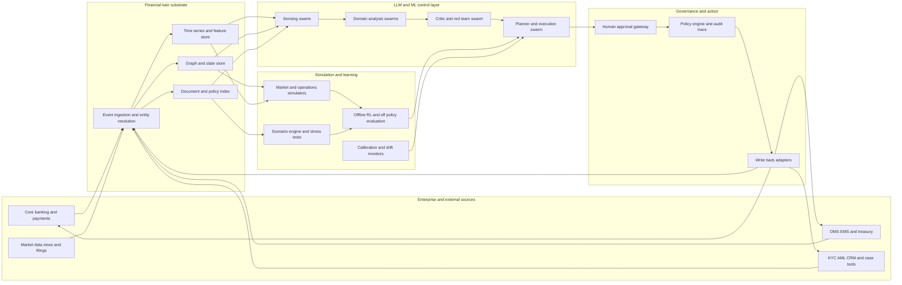

# FinTwinOS reference architecture

FinTwinOS keeps a continuously updated digital twin of a financial firm and exposes
that twin through typed read, simulate, propose and execute functions. The posture is
deliberate: **aggressive on simulation and evaluation, conservative on autonomy.**
Reinforcement learning optimises bounded control decisions first, queue routing,
simulation budgets, hedging candidate selection, escalation thresholds, staffing,
scenario prioritisation, before it touches any irreversible act.

This page is the complete reference architecture. Every component is mapped to its
module path in the [component map](#component-to-module-map) at the end. For the
security analysis of these components see the [threat model](threat-model.md); for
the regulatory mapping see the [governance controls map](governance-controls-map.md).

## System overview



Reading the diagram left to right: enterprise sources stream into the twin substrate
as canonical event envelopes; agent swarms sense and analyse twin state through typed
tools; simulators and the learning layer rehearse decisions against the twin before
anything is proposed; and every action that could touch the real world passes through
the human approval gateway, the policy engine and the audit trail. The write-back
adapters at the far right are the **only** path back to production systems, and in
this release they write to a local outbox (`settings.data_dir / "outbox"`), never to
a live external system.

## Design trade-offs

These are the founding architecture decisions and the trade-offs accepted with each.

| Decision | Stance | Trade-off accepted | Where in FinTwinOS |
|---|---|---|---|
| Twin topology | **Federated domain twins** with shared canonical entities (customer, legal entity, account, instrument, trade, case, policy, scenario) | More schema discipline up front than a single monolithic store, in exchange for domain autonomy and clean blast-radius boundaries | `fintwinos/core/types.py` (canonical models), `fintwinos/twin_core/` (stores) |
| Orchestration | **Durable external orchestration graph** for regulated workflows; prompt-only self-orchestration only for low-risk read-only work; workflow compilation later for mature procedures | Less LLM flexibility on regulated paths, in exchange for replayable, inspectable runs | `fintwinos/agents/runtime.py` (`handle_case`), `fintwinos/agents/base.py` (`Blackboard`) |
| Tool protocol | **Dual layer**: internal canonical tool SDK plus an MCP/JSON-RPC-compatible edge | Maintaining two surfaces, in exchange for governance fields the bare MCP schema lacks | `fintwinos/tools/registry.py`, `fintwinos/tools/envelope.py`, `fintwinos/tools/server.py` |
| Learning strategy | **Staged**: rules → offline RL → shadow → narrow online | Slower autonomy ramp, in exchange for hard-constraint evidence at every stage | `fintwinos/rl/` |
| Simulation model | **Hybrid** rules + agent-based + ML simulators | Higher engineering cost than one ML world-model, in exchange for auditability and per-component calibration | `fintwinos/twin_sim/` |
| Memory design | **Blackboard + local memories** | More explicit data flow than free-form shared context, in exchange for leakage limits and traceability | `fintwinos/agents/base.py` (`Blackboard`) |
| Deployment | **Tenant-isolated hybrid** cloud/on-prem | No multi-tenant economies of scale, in exchange for data residency and supervisory comfort | [Deployment runbook](runbooks/deployment.md) |

## 1. The federated twin substrate

The twin is not a prompt and not a vector index. It is a stateful substrate with
three typed stores plus a replay engine, assembled into a single
`TwinRuntime` dataclass (`fintwinos/core/interfaces.py`) by
`fintwinos.twin_core.runtime.build_runtime(seed=7, with_demo_data=True)`:

- **`GraphStore`**, entities and relationships: customers, accounts, instruments,
  legal entities, cases, fraud rings. Backed by `networkx`; supports
  `upsert_entity`, `add_relationship`, `neighbors`, `subgraph` and `stats`.
- **`TimeSeriesStore`**, market and operational dynamics keyed by series name:
  prices, balances, queue depths, funding spreads. Supports `append`, `window`,
  `latest`, `keys`.
- **`DocumentStore`**, filings, internal procedures, customer artefacts and
  supervisory rules, with `add`, `get`, `search` and `count`.
- **`ReplayEngine`**, records every `EventEnvelope` into episodes and replays them
  through a handler for counterfactual analysis (`record`, `episode`, `episodes`,
  `replay`).

The canonical entity set lives in `fintwinos/core/types.py`: `Customer`,
`LegalEntity`, `Account`, `Instrument`, `Trade`, `Position`, `CaseRecord`,
`PolicyDoc`, `Scenario`, `Alert`, plus the result and decision types
(`SimulationResult`, `ToolResult`, `ApprovalToken`, `Decision`). All of these are
Pydantic models; `fintwinos export-schemas` writes their JSON Schemas to disk via
`fintwinos/core/schema_export.py` so adopters can validate integrations against the
exact canonical shapes.

Federation means each domain (risk, trading, compliance, treasury, customer ops)
maintains its own slice of graph, series and documents, but all slices share the
same canonical entity types and the same `EntityRef` addressing scheme
(`entity_type:entity_id`), so a customer in the compliance subgraph and the same
customer in the customer-ops journey state are one entity.

| Domain | Twin mirrors | Swarm does | Value |
|---|---|---|---|
| Risk | Positions, exposures, market states, limits, scenarios, model versions | Simulates shocks, proposes hedges, tests policy changes, explains limit breaches | Faster stress testing, better limit governance, model lineage |
| Trading | Order flow, inventory, venue conditions, market-impact assumptions | Rehearses routing, execution, inventory choices before production | Lower slippage risk, safer strategy iteration, surveillance |
| Compliance | Customer/entity graph, KYC docs, alerts, policy corpus, case history | Prioritises alerts, drafts narratives, finds policy support, simulates false-positive trade-offs | Higher analyst throughput with preserved auditability |
| Treasury | Cash ladders, collateral pools, intraday liquidity, funding spreads | Simulates liquidity scenarios, recommends transfers, prioritises contingency actions | Resilience and funding efficiency under stress |
| Customer ops | Journey state, channel history, documents, complaints, SLA queues | Routes cases, predicts escalations, drafts compliant responses, simulates service policy changes | Lower handling time, fewer SLA breaches |

## 2. The data plane

Everything enters the twin as an **`EventEnvelope`**
(`fintwinos/core/types.py`): a typed unit carrying `kind`, `occurred_at`,
`recorded_at`, `source`, the affected `entities`, an arbitrary `payload`, an
optional `episode_id` and a `Provenance` block (source system, ingestion time,
record hash, licence). Envelopes expose a `content_hash()` (SHA-256 over kind,
source and payload) so downstream consumers can detect mutation in flight.

- **Connectors** (`fintwinos/connectors/`) adapt enterprise and external sources,
  SEC EDGAR, CSV drops, CDC streams, webhooks, into async `EventEnvelope` streams
  (`Connector` protocol in `fintwinos/core/interfaces.py`).
- **Ingestion** goes through `runtime.ingestor` (`EventIngestor` protocol); the
  ingestor updates the stores, stamps provenance, and hands the envelope to the
  replay engine. Failures raise `IngestionError` (`fintwinos/core/errors.py`) rather
  than silently dropping data.
- **Episodes** group envelopes into replayable units. The replay engine is what
  makes counterfactual analysis, calibration backtests and incident forensics
  possible, the same recorded episode can be re-driven through new policy rules,
  new simulators or new agent versions.
- **Synthetic data** (`fintwinos/datasets/`) provides deterministic generators,
  transactions, fraud rings, customer journeys, market paths, seeded via
  `numpy.random.default_rng(seed)` so demos and tests are reproducible offline.

## 3. The function-call layer: four bands, five governance fields

Agents never touch the stores directly in production paths. All access goes through
the typed tool registry (`fintwinos/tools/registry.py`), which is the single point
of validation, gating, auditing and dispatch. The default catalog over a runtime is
built by `fintwinos.tools.catalog.build_default_registry(runtime, policy_gate=None,
settings=None)`.

### The four bands

Every tool name is prefixed with its band, and the registry **rejects registration**
of any tool that violates its band's invariants (`ToolSpec` model validation):

| Band | Prefix | May do | Invariant enforced at registration |
|---|---|---|---|
| Observe | `observe_*` | Read twin state | Side effect must be `none` or `read` |
| Simulate | `simulate_*` | Run simulators against twin state | Side effect must be `none` or `read` |
| Propose | `propose_*` | Draft plans, narratives, candidate actions | Side effect must be `none` or `read` |
| Execute | `execute_*` | Touch the world (via the outbox) | Must declare a `reversible` or `irreversible` side effect **and** `requires_human_approval=True` |

### The five governance fields

Beyond a normal JSON-Schema tool description, every `ToolSpec` carries five
governance fields, exported in the MCP-style public catalog as `x_`-prefixed
extensions (`ToolSpec.to_public_dict()`):

1. **Risk tier** (`risk_tier`: low / medium / high / critical), drives policy
   matching via `min_risk_tier` rules.
2. **Approval policy** (`requires_human_approval`), execute tools must set it;
   policy rules can additionally demand review for any band.
3. **Side-effect class** (`side_effect`: none / read / reversible / irreversible),
   structurally checked against the band.
4. **Idempotency** (`idempotent`, plus `CallContext.idempotency_key`), replays of
   the same keyed call return the cached `ToolResult` instead of re-running.
5. **Provenance requirement** (`provenance_required`), results must carry
   `Provenance` records; the registry attaches a twin-sourced provenance stamp if
   the handler does not.

### The dispatch pipeline

`ToolRegistry.call(name, arguments, context)` runs, in order:

1. **Schema validation**, arguments are validated against the tool's JSON Schema
   (Draft 2020-12); failures are audited as `tool.schema_rejected` and returned as
   errors, never raised into the orchestrator.
2. **Hard execute gating**, independent of any configurable policy, an execute
   call is refused unless `FINTWIN_EXECUTE_TOOLS_ENABLED=1` **and** a valid
   `ApprovalToken` is attached to the `CallContext`. Dry runs of execute tools are
   always permitted and return a `{"dry_run": true, ...}` preview without invoking
   the handler.
3. **Policy gate**, the configurable `PolicyGate` (section 7) is consulted;
   verdicts are audited as `policy.checked`.
4. **Idempotency replay**, keyed repeats return the cached result
   (`tool.idempotent_replay`).
5. **Invocation**, the handler runs (sync or async); the call and completion are
   audited (`tool.called`, `tool.completed`) with the audit record hash returned in
   `ToolResult.audit_ref`, and handler exceptions are captured as failed results
   (`tool.failed`), never crashes.

### The MCP-style edge

`fintwinos serve-tools` serves the catalog over JSON-RPC 2.0 (`tools/list`,
`tools/call`, envelope helpers in `fintwinos/tools/envelope.py`, FastAPI app in
`fintwinos/tools/server.py`, installed with the `[server]` extra). External
MCP-compatible clients see standard tool descriptions plus the five governance
fields; the registry's gating applies identically regardless of transport.

## 4. The agent layer: hierarchical and debating

The agent pattern is **hierarchical-and-debating orchestration**: a planner
decomposes the objective, a sensing swarm gathers twin state and checks freshness,
domain swarms work in parallel, a critic/red-team swarm attacks the draft, and an
execution swarm assembles a bounded plan, proposals only, unless every gate passes.

Foundations in `fintwinos/agents/base.py`:

- **`BaseAgent`**, one subclass per role. Each agent declares a `task_class` so the
  model router picks the right tier, and **must** work offline through deterministic
  rule-based fallbacks: `ctx.llm.offline` tells the agent it is getting stubs, and
  the LLM is an enrichment, never a hard dependency.
- **`Blackboard`**, thread-safe shared memory for one case run, with a full posting
  history (`post`, `read`, `latest`, `topics`, `history`). Shared state flows
  through the blackboard, not hidden globals, so a run's complete intermediate state
  is inspectable after the fact. Local agent memories stay local, this is the
  leakage-limiting memory design.
- **`AgentContext`**, everything an agent may touch: the runtime, the registry, the
  LLM client, the blackboard, settings and the audit trail. `AgentContext.tool()`
  routes every observation through the registry so it is audited.
- **`TaskSpec` / `AgentOutput`**, the typed plan-step and result units, with
  explicit `depends_on` edges and per-output `confidence` and `warnings`.

The durable orchestrator lives in `fintwinos/agents/runtime.py`. The canonical entry
point is:

```python
fintwinos.agents.runtime.handle_case(case_id, objective, runtime, registry, llm) -> dict
```

which returns `{"status": "complete" | "awaiting_human" | "blocked", "decision": ...,
"policy": ...}`. `awaiting_human` means the policy gate demanded review and the run
parked pending an `ApprovalToken`; `blocked` means a deny rule matched. The planner's
output is a typed `Decision` (`fintwinos/core/types.py`) with
`action_type="propose_only"` or `"execute"`, the planned tool calls, the rationale
and the risk tier, and `PolicyGate.check_decision` forces human review on every
executing decision regardless of tier.

Prompt-only self-orchestration is reserved for low-risk, read-only work; regulated
workflows always run through the durable orchestration graph so every step is
replayable.

## 5. The model layer

- **LLM routing** (`fintwinos/models/llm_routing/router.py`) maps task classes to
  configured model tiers: planning/analysis/critique → `FINTWIN_LLM_MODEL_PRIMARY`
  (default `gpt-5`), drafting/extraction → `FINTWIN_LLM_MODEL_FAST` (default
  `gpt-5-mini`), classification/routing/cheap calls → `FINTWIN_LLM_MODEL_CHEAP`
  (default `gpt-5-nano`). Routing is configuration-driven so adopters can remap
  tiers to any models approved by their model-risk function.
- **LLM client** (`fintwinos/models/llm_routing/client.py`) wraps the async OpenAI
  SDK with retries, strict JSON-schema output, token/cost metering
  (`usage_summary()`), and, critically, a **deterministic offline stub**: with
  `FINTWIN_OFFLINE=1` or no API key, every call returns a reproducible stub and
  agents fall back to their rule-based paths. Tests and demos never need network
  access. See the [LLM routing model card](model-cards/llm-routing.md).
- **Classical models** (`fintwinos/models/`), the graph AML scorer (see the
  [AML subgraph scorer card](model-cards/aml-subgraph-scorer.md)), time-series
  forecasters and tabular scorecards, are implemented in numpy/networkx, versioned,
  and registered in the model inventory like everything else.

## 6. The RL layer: staged, bounded, constraint-first

Learning lives in `fintwinos/rl/` and follows a strict staircase. No stage is
skipped, and each stage produces the evidence required by the
[release gates](evaluation.md#release-gates) before the next is considered:

1. **Rules / supervised baselines**, deterministic policies for the bounded
   control decisions (queue routing, simulation budgets, hedging candidate
   selection, escalation thresholds, staffing, scenario prioritisation). These are
   the comparators every learned policy must beat.
2. **Offline RL**, conservative offline learning from replay-buffer data recorded
   by the twin, with off-policy evaluation before anything runs live.
3. **Shadow mode**, the learned policy runs alongside the incumbent
   (`FINTWIN_SHADOW_MODE=1`), producing decisions that are logged and compared but
   never acted on.
4. **Narrow online adaptation**, only for bounded, reversible decisions, only
   after shadow evidence, and always inside the policy gate.

Rewards combine business payoff with **hard** risk and compliance constraints,
Expected Shortfall penalties for risk and treasury decisions, recall floors for
compliance, fairness guardrails for customer-facing routing. A policy that violates
a hard constraint in replay or shadow does not ship, whatever its average reward.

## 7. Sim-to-real calibration

Simulators (`fintwinos/twin_sim/`, registered onto a runtime by
`fintwinos.twin_sim.register_all(runtime)`) are **never treated as faithful
worlds**. The contract (`Simulator` protocol, `fintwinos/core/interfaces.py`)
enforces honesty about uncertainty:

- Every run takes a `Scenario` and a `seed` and returns a `SimulationResult` with
  point `metrics`, full `series`, **`confidence` intervals for every headline
  metric**, a `calibration` block, `warnings` and the `assumptions_version`, never
  bare point estimates.
- Every simulator exposes `calibration_report()` with its current diagnostics.
- Continuous calibration runs against historical replay episodes and offline data:
  Kolmogorov–Smirnov distances between simulated and realised distributions, and
  empirical coverage of the nominal confidence intervals. Out-of-tolerance
  diagnostics surface in each result's calibration block, and the
  `CalibrationError` type lets operators pull the simulator from
  decision-support use. The full procedure is in the
  [calibration runbook](runbooks/calibration.md).
- All randomness flows through `numpy.random.default_rng(seed)`; the same scenario
  and seed always reproduce the same result, which is what makes simulation
  evidence auditable.

## 8. The governance plane

Governance is not a wrapper; it is the plane the other layers stand on.

- **Policy gate** (`fintwinos/policy/gates.py`), ordered `PolicyRule`s with three
  effects: the first matching `deny` wins immediately; `require_approval` matches
  accumulate; `allow` marks explicit permission. The execute band is
  **default-deny**: with no explicit allow rule it is blocked even before approval
  tokens are considered. The shipped default pack denies critical-tier irreversible
  actions outright, flags high/critical-risk proposals for review, and requires
  review on every execute call. Rule packs are loadable from YAML
  (`fintwinos/policy/`).
- **Approvals** (`ApprovalToken`, `fintwinos/core/types.py`), scoped to a subject
  (tool name or decision id), carrying grantor, role, status and expiry;
  `is_valid_for()` checks all of these. `FINTWIN_DUAL_CONTROL_REQUIRED=1` (the
  default) demands maker-checker countersigning for sensitive grants.
- **Audit trail** (`fintwinos/core/audit.py`), every observation, tool call,
  policy check, simulation branch, human approval and write-back event appends a
  hash-chained `AuditRecord`: each record's SHA-256 hash covers its canonical JSON
  body plus the previous record's hash, so any retrospective edit breaks the chain
  and `AuditTrail.verify()` detects it. Optional JSONL persistence
  (`FINTWIN_AUDIT_PATH`) supports export to WORM storage.
- **Kill switch**, `FINTWIN_EXECUTE_TOOLS_ENABLED=0` (the default) disables the
  execute band in the registry itself, beneath the policy layer; a runtime
  prepended deny-all rule covers the in-process case. See the
  [incident-response runbook](runbooks/incident-response.md).
- **Environments**, `FINTWIN_ENVIRONMENT` is `local`, `shadow` or `production`;
  the deployment rule (no write-enabled production access until replay, shadow,
  human review and control testing pass) is encoded as the staged rollout in the
  [deployment runbook](runbooks/deployment.md).

## Component-to-module map

| Component | Module path | Canonical entry point |
|---|---|---|
| Canonical entities, envelopes, results, decisions | `fintwinos/core/types.py` |, |
| Module contracts (store/simulator/connector protocols, `TwinRuntime`) | `fintwinos/core/interfaces.py` |, |
| Settings and environment flags | `fintwinos/core/config.py` | `get_settings()` |
| Hash-chained audit trail | `fintwinos/core/audit.py` | `AuditTrail` |
| Exception hierarchy | `fintwinos/core/errors.py` |, |
| Canonical JSON Schema export | `fintwinos/core/schema_export.py` | `fintwinos export-schemas` |
| Twin stores, ingestion, replay, demo data | `fintwinos/twin_core/` | `build_runtime(seed=7, with_demo_data=True)` |
| Simulators (market, liquidity, compliance ring, customer ops) | `fintwinos/twin_sim/` | `register_all(runtime)` |
| Typed tool registry and band invariants | `fintwinos/tools/registry.py` | `ToolRegistry` |
| Default tool catalog | `fintwinos/tools/catalog.py` | `build_default_registry(runtime, ...)` |
| MCP-style JSON-RPC envelopes | `fintwinos/tools/envelope.py` |, |
| Tool server (FastAPI, `[server]` extra) | `fintwinos/tools/server.py` | `fintwinos serve-tools` |
| Policy rules and gate | `fintwinos/policy/gates.py` | `PolicyGate` |
| LLM task-class routing and cost estimation | `fintwinos/models/llm_routing/router.py` | `ModelRouter` |
| Async OpenAI client with offline stub | `fintwinos/models/llm_routing/client.py` | `LLMClient` |
| Classical models (AML graph scorer, forecasters, scorecards) | `fintwinos/models/` |, |
| Agent base classes and blackboard | `fintwinos/agents/base.py` | `BaseAgent`, `Blackboard` |
| Durable case orchestrator | `fintwinos/agents/runtime.py` | `handle_case(...)` |
| Replay buffers, offline RL, bandits, OPE, shadow gating | `fintwinos/rl/` |, |
| Evaluation suites and reports | `fintwinos/evals/` | `run_suites(suite, report_prefix)` / `fintwinos eval` |
| Connectors (EDGAR, CSV, CDC, webhook) | `fintwinos/connectors/` |, |
| Synthetic dataset generators and data cards | `fintwinos/datasets/` |, |
| Packaged demos (all offline-capable) | `fintwinos/demos/` | `fintwinos demo <name>` |
| Command-line interface | `fintwinos/cli.py` | `fintwinos` |

## Further reading

- [Threat model](threat-model.md), how each of these components is attacked and
  defended.
- [Governance controls map](governance-controls-map.md), the regulatory mapping.
- [Evaluation & release gates](evaluation.md), the evidence each layer must
  produce before promotion.
- [Research basis](research-basis.md), why the architecture looks like this.

---

FinTwinOS, created by [Yash Sharma](https://www.linkedin.com/in/yashsharmaa/), MIT License.
