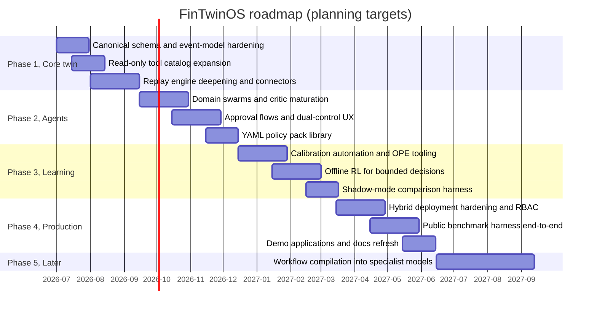

# Roadmap

FinTwinOS ships v0.1.0 with the full vertical slice, federated twin, typed tool
bands, agent swarms, calibrated simulators, staged RL scaffolding, governance plane,
evals and offline demos. The roadmap below is about deepening each layer in the
order the [deployment rule](governance-controls-map.md#the-deployment-rule)
demands: evidence first, autonomy last.

Dates are planning targets from 2026-07 onward, not commitments; the gates in
[evaluation](evaluation.md#release-gates) decide when a phase actually closes.

## Phases

### Phase 1, Core twin (2026-07 → 2026-09)

Harden the canonical twin schema and event model; broaden the read-only tool
catalog; deepen the replay engine (episode diffing, counterfactual replay at
scale); add more connectors (EDGAR refinement, CDC, webhook hardening). Exit
criterion: the function-call gate holds across two consecutive releases.

### Phase 2, Agents and approvals (2026-09 → 2026-12)

Mature the domain swarms and critic patterns; richer human approval flows
(approval queues, expiring grants, dual-control UX over the MCP edge); YAML policy
pack library for common institutional postures. Exit criterion: the agent-run gate
holds, including multi-run consistency, and approver drills complete.

### Phase 3, Learning (2026-12 → 2027-03)

Simulator calibration at production cadence (automated KS/coverage monitoring per
the [calibration runbook](runbooks/calibration.md)); off-policy evaluation
tooling; conservative offline RL for the bounded control decisions; shadow-mode
comparison harness. Exit criterion: at least one bounded decision where offline RL
beats the rule baseline in shadow without a single hard-constraint violation.

### Phase 4, Production hardening (2027-03 → 2027-06)

Hybrid/on-prem deployment hardening; RBAC integration points; audit-chain
anchoring tooling; the public benchmark harness run end-to-end (BFCL V4,
FinMCP-Bench, SECQUE, Finance Agent Benchmark, BlueFin, Elliptic2 adapters);
polished demo applications. Exit criterion: the platform gate (trace completeness,
control-test drills, recovery time) holds in a reference deployment.

### Phase 5, Compiled specialists (2027-06 →)

Only once workflows are stable and governance is externalised: compile mature,
durably-orchestrated workflows into specialist models.

## Timeline

## The "compiled specialist models later" stance

Workflow-compilation research (2026) shows that stable, well-instrumented
workflows can be distilled into smaller specialist models. FinTwinOS deliberately
sequences this **last**:

- **Stability first.** Compiling a workflow freezes it. Until a workflow has
  survived replay, shadow, human review and control testing unchanged for a full
  cycle, compilation just bakes in churn.
- **Governance must be external before it can survive compilation.** The policy
  gate, approval tokens and audit chain live *outside* the model in FinTwinOS
  precisely so that swapping an LLM for a compiled specialist changes nothing
  about who can approve what. Compilation is safe only because the control plane
  does not move.
- **Evidence transfers.** A compiled specialist inherits the workflow's eval
  suites and release gates verbatim, it must beat the orchestrated version on the
  same reports before replacing it, and it enters at the *replay* stage of the
  deployment rule like any other model change.

Until then, the durable orchestration graph remains the system of record for
regulated workflows, and prompt-only self-orchestration remains confined to
low-risk read-only work, per the
[orchestration experiment](evaluation.md#2-prompt-only-vs-durable-orchestration).

## What will not change

- The four tool bands and the five governance fields.
- Execute-band default-off (`FINTWIN_EXECUTE_TOOLS_ENABLED=0`) and default-deny.
- Offline-first operation (`FINTWIN_OFFLINE=1`) as a fully supported mode.
- The hash-chained audit trail as the system of evidence.
- MIT licensing and open development against [CONTRACTS.md](../CONTRACTS.md).

---

FinTwinOS, created by [Yash Sharma](https://www.linkedin.com/in/yashsharmaa/), MIT License.
